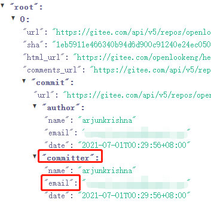
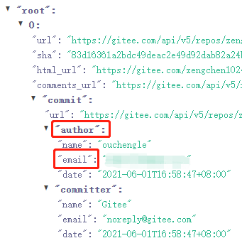

## 机器人是怎么检查PR是否签署了CLA的

机器人是通过检查PullRequest中**所有commit**作者的邮箱是否都签署了CLA来判定PR是否完成了CLA签署

## 怎么查看PR所有commit的作者的邮箱

请访问这个[网页](https://gitee.com/api/v5/swagger#/getV5ReposOwnerRepoPullsNumberCommits)，输入pr信息进行查看

**非轻量级PR**中某个commit的作者的邮箱见下图。



[**轻量级PR**](https://gitee.com/help/articles/4291)中某个commit的作者的邮箱见下图。



## 当某个commit作者的邮箱未签署CLA怎么处理

   使用该邮箱签署CLA

   如果该邮箱签署的是员工CLA，请确保该邮箱已经被所属企业的CLA管理员激活

## 开发建议

### 怎么设置本地开发环境

在开发前请按如下方式配置git。这里的邮箱必须是已经签署过CLA

```sh
git config user.name [gitee id]

git config user.email example@xx.com
```
