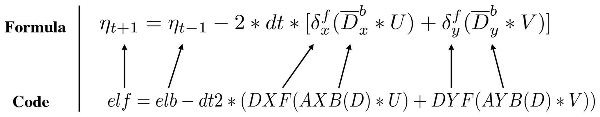

| title | authors | owning-sig | participating-sigs | status | creation-date | reviewers | approvers | stage | milestone |
| ----- | ------- | ---------- | ------------------ | ------ | ------------- |---------- | --------- | ----- | --------- |
| MEP-AI4EARTH | @wangmin0104  | wg-ai4earth | sig-parallel, sig-akg | provisional | 2021-01-06 | TBD | TBD | NA | "v1.1" |

# MEP-AI4EARTH: MindSpore AI for Earth

## Table of Contents

<!-- toc -->

- [Summary](#summary)
- [Motivation](#motivation)
    - [Goals](#goals)
    - [Non-Goals](#non-goals)
- [Proposal](#proposal)
    - [User Stories](#user-stories)
- [References](#references)

<!-- /toc -->

## Summary

Earth system modeling simulation is an important way to study global change, has played a vital role in many fields, including national economy, military, agriculture and some other aspects. The ocean model and climate model are important components of earth system modeling which have an important impact on people's productive and lives. This project aims to develop a community collaboration for deep learning framework's application in ocean model and climate model.

## Motivation

Most of the existing ocean and climate models are solved by numerical methods. Such a method has two fundamental limitations: (a) the process of code implementation, debugging and maintenance is complex. (b) the growing demand for high space-time resolution requires more computing resources, which can only be provided by supercomputers[1]. MindSpore is a powerful deep learning framework which can provides user-friendly API, operator fusion and auto-paralleling capabilities, supporting CPU, Ascend and GPU backend. Based on the MindSpore, the process of solving ocean and climate models can be accelerated. At the same time, it can be combined with deep learning ways to improve the computational efficiency and prediction accuracy of these models simulation[2]. However, unlike the mature deployment of deep learning in computer vision and natural language processing, its development in ocean and climate models simulations is still at an early stage[3].

### Goals

The goals of this project are as follows:

- To design a user-friendly programming model and API for the implementation of ocean and climate model.

- To develop a high-performance system with highly efficient graph and operator fusion, large-scale auto-paralleling.

- To build a common earth system model AI framework.

### Non-Goals

- None.

## Proposal

To address the limitations of existing ocean model and climate model, proposals and contributions on the following aspects are welcomed.

- **programming model and API.** For a user-friendly model, it can easily convert the discrete PDEs into the corresponding operator expression forms and enable code-as-equation expressions. By abstracting key stencil operators, the code to express the discrete PDEs will be very simple. The abstracted operators will greately simplify the development and maintenance of ocean models.

- **high performance system.** The graph level optimizations such as graph-aware operator fusion and kernel-level optimizations should be designed to achieve high performance in ocean and climate models computation. And the use of diffrent data-spliting methods for distributed areas can greatly affect computing performance, so a distributed strategy for efficient grid boundary parallel should be developed.

- **AI-PDE.** In classical numerical methods, such as finite differential and finite element methods, their computation complexity in the grid grow exponentially with the dimensions of the PDE, resulting in dimensional disasters. Deep learning methods have a very strong nonlinear fit capability in approximation of high-dimensional functions, so we consider using deep learning to solve PDE to overcome dimensional disasters.

### User Stories

 Stencil operator can be abstracted from PDEs of ocean model to represent the average and differential operations. All stencil operators for the finite difference calculations are named using three letters in the form [A|D][X|Y|Z][F|B]. The first letter contains two options, A or D, indicating an average or a differential operator. The second letter contains three options, X, Y, or Z, representing the direction of the operation. The last letter contains two options, F or B, representing forward or backward operation. Though the stencil operator, users can quickly convert the discrete PDEs into the corresponding operator expression forms. Figure 1 shows the one-to-one correspondence of each item in the code and the items in the sea surface elevation equation. The code is very easy to program and understand. Clearly, the basic operators and the combined operators greatly simplify the development and maintenance of ocean models.

Given a computation graph, the engine to generate the corresponding source code (Fig. 2). Each operator node in the computation graph is called a kernel. The sequence of all kernels in a graph is usually fused into a large kernel function. Therefore, the engine schedules and executes the fused kernel once and obtains the final result directly without any auxiliary or temporary variables. Most of the scientific computational applications are limited by the memory bandwidth and cannot fully exploit the computing power of a processor. Fortunately, kernel fusion is an effective optimization method to improve memory locality.

In the last few years, deep learning has been used very effectively in diverse applications, such as computer vision and natural language processing. Despite the remarkable success in these and related areas, deep learning has not yet been widely used in the field of scientific computing. More recently, solving PDEs in the standard differential form, via deep learning has emerged as a potentially new sub-field. The physics-informed neural networks (PINNs),which embed a PDE into the loss of the neural network using automatic differentiation, is simple and can be applied to different types of PDEs, including integro-differential equations, fractional PDEs, and stochastic PDEs. Figure 2 shows structure of PINN for solving the diffusion equation with mixed boundary conditions amd initial conditions. The procedure of PINNs algorithm for solving differential equations:

- Step 1, construct a neural network u(x;θ) with parameters θ.
- Step 2, specify the two training sets Tf and Tb for the equation and boundary/initialconditions.
- Step 3, specify a loss function by summing the weighted L2 norm of both the PDEs equation and boundary condition residuals.
- Step 4, train the neural network to find the best parameters θ by minimizing the loss function.

With the improvement of the infrastructure, deep learning is expected to bring a larger impact and more opportunities to earth system modeling in the near future.

  

## References

[1] Huang X, Huang X, Wang D, et al. OpenArray v1. 0: a simple operator library for the decoupling of ocean modeling and parallel computing[J]. Geoscientific Model Development, 2019, 12(11).

[2] Han Y, Zhang G J, Huang X, et al. A moist physics parameterization based on deep learning[J]. Journal of Advances in Modeling Earth Systems, 2020, 12(9): e2020MS002076.

[3] Lu L, Meng X, Mao Z, et al. DeepXDE: A deep learning library for solving differential equations[J]. arXiv preprint arXiv:1907.04502, 2019.
