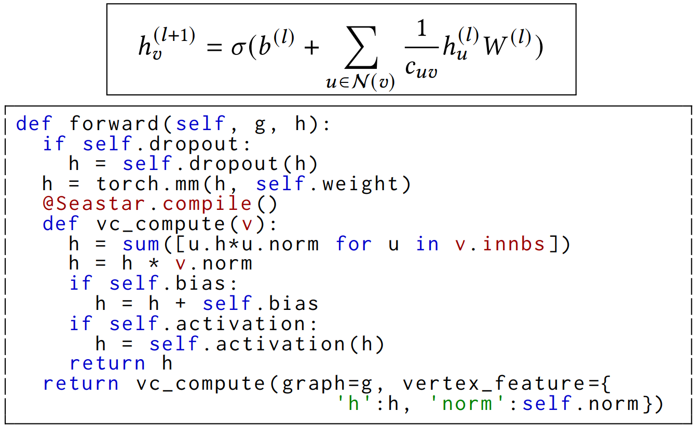
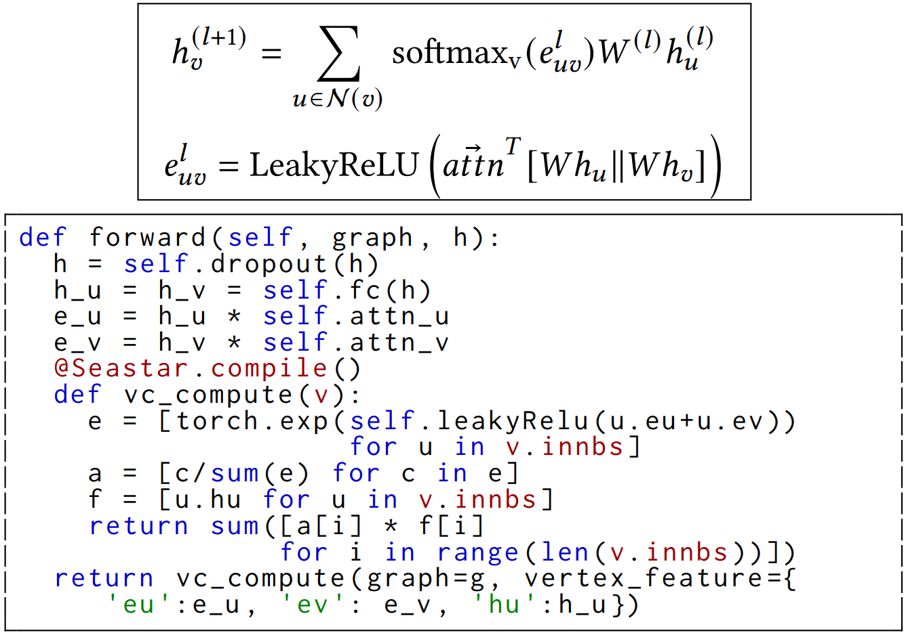
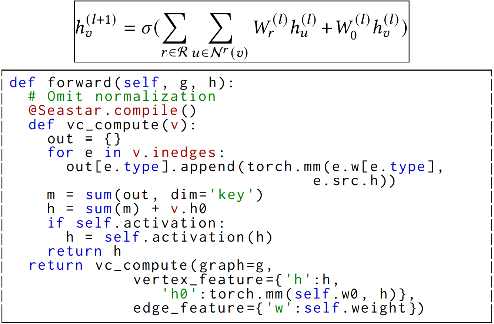
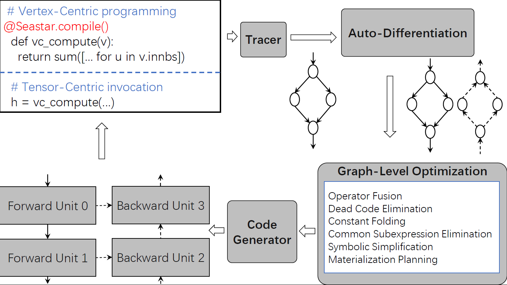
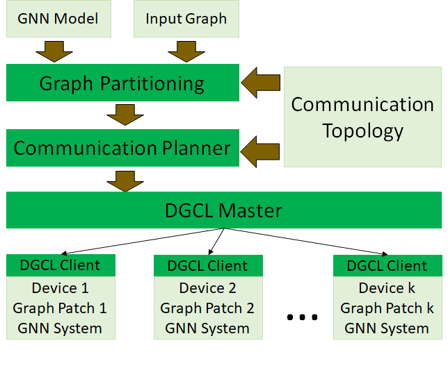

| title | authors | owning-sig | participating-sigs | status | creation-date | reviewers | approvers | stage | milestone |
| ----- | ------- | ---------- | ------------------ | ------ | ------------- |---------- | --------- | ----- | --------- |
| MEP GNN | @ydwu4| GNN | | provisional | 2020-11-30 | | TBD | alpha | alpha: "v0.1" |

# MEP-GNN

## Table of Contents

<!-- toc -->

- [Summary](#summary)
- [Motivation](#motivation)
    - [Goals](#goals)
    - [Non-Goals](#non-goals)
- [Proposal](#proposal)
    - [User Stories](#user-stories)
        - [GCN](#GCN)
        - [GAT](#GAT)
        - [R-GCN](#R-GCN)
- [Design Details](#design-details)
- [Implementation History](#implementation-history)
- [Drawbacks](#drawbacks)
- [Alternatives](#alternatives)
- [References](#references)

<!-- /toc -->

## Summary

Graph neural networks (GNNs) have achieved breakthrough performance in graph analytics such as node classification, link prediction and graph clustering. Existing GNN training frameworks suffer from various performance and usability issues. This project aims to develop an efficient, scalable and user-friendly GNN system based on the powerful DL backend --- MindSpore. Application libraries consisting of the implementations of various GNN models will also be developed.

## Motivation

Existing GNN training frameworks such as DGL[1], PyG [2], GraphLearn [3], Euler [4], NeuGraph [5] and Roc [6] can be mostly characterized as GNN operator libraries to be plugged into existing deep learning systems. However, such a design has two fundamental limitations: (1) Existing GNN training frameworks use a whole-graph tensor-centric programming model, which is designed to implement GNN operators as plug-ins of a DL system, but this makes the actual implementation of a GNN model difficult to follow from the conceptual design of the model, especially when graph operations are involved; (2) Existing designs expose a trade-off between the generality of operators and performance optimization, e.g., some prefer generality and decompose GNN computations into graph propagation primitives and connect with other DL operators by materializing the intermediate tensors, which results in excessive memory consumption and massive data movements; while others provide fused kernels for commonly used operator combinations, but result in limited generality and sub-optimal performance.

In addition, for distributed GNN training, existing network communication strategies suffer from high overheads. Modern GPU servers (e.g., NVIDIA DGX systems) contain heterogeneous physical connections such as NVLink, PCIe, QPI, IB and Ethernet, and the bandwidth of the fastest link can be an order of magnitude larger than that of the slowest link. Existing methods usually use the direct links between workers and do not fully exploit the fast links. This results in network contention and load imbalance given the complex connections among GPUs in a modern GPU cluster.

### Goals

- To design a user-friendly programming model and API for the implementation of various types of homogeneous and heterogeneous GNN models.
- To develop a high-performance system for GNN training with novel optimizations, e.g., highly efficient fused GPU kernels.
- To construct a distributed graph communication library for efficient GNN training on multiple GPU servers.
- To build application libraries that consist of the implementations of various GNN models.

### Non-Goals

- GNN training on a very large graph using CPUs instead of GPUs (which is an interesting topic but a non-goal here as this project uses MindSpore as the DL backend).

## Proposal

To address the limitations of existing GNN training frameworks, proposals and contributions on the following aspects are welcome.

1. **Programming Model and API.** A user-friendly programming model that does not put the burdens of translating the logic computation or algorithm of a GNN model design to tensor operations in the DL backend on users should be designed. The application programming interface (API) should also be simple and require minimal learning efforts from users, for example, the API mainly makes use of the popular Python syntax.
2. **Core Engine for GNN Training.**  The core engine first compiles the user program and generates code for GNN training. Both computational graph level optimizations such as graph-aware operator fusion and kernel-level optimizations for GNN training should be designed to achieve high performance in training.
3. **Communication in Distributed GNN Training.**  The problem of optimizing the communication efficiency for distributed GNN training should be formulated to jointly consider better utilization of fast links, fusing communication, avoiding contention and balancing loads on different links between all worker pairs. A distributed graph communication library for efficient GNN training should be developed.
4. **Application Libraries.**  A broad range of GNN models, both homogeneous and heterogeneous GNN models and especially those that have been widely adopted in both industry and academia, should be implemented using the proposed GNN system and run on the MindSpore DL backend. These implementations will be packaged as application libraries under the project.

### User Stories

We prefer a programming model that is high-level and expressive. For example, the following examples show both the algorithm and their implementation of three classic GNN models using a programming model that we have designed.

#### GCN

  

#### GAT

  

#### R-GCN

  

## Design Details

A feasible design for the four aspects in the proposal is presented as follows. We first design a **vertex-centric GNN programming model**, which features a very simple API with idiomatic Python syntax. In contrast to the whole-graph tensor-centric model of existing GNN training frameworks, users only need to program the operation on a single vertex and how it interacts with its neighbors, instead of programming the operations on the whole graph. Users can access the vertex's own features and the features of its neighbors using Python's built-in ‘dot’ syntax. Aggregation of the neighbors' features can also be simply expressed using Python's list comprehension and aggregation. The API mainly consists of a function decorator and users implement the application logic in a decorated function, which is then transparently compiled by the GNN system and executed on each vertex in the input graph. There is a clear correspondence between the GNN algorithm (i.e., the GCN equation) and the vertex-centric implementation. The benefit is bi-directional: users can implement an algorithm easily and code readers can learn the algorithm by directly checking its implementation.

Next we present the code generation process, i.e., how our system compiles the vertex-centric program and uses it for GNN training. Different from most existing GNN training frameworks, our design decouples its implementation from the DL backend. The decoupling design is because merging with the DL backend would require many changes in its intermediate representation and code optimization process, which is a non-trivial task (for both merging and update maintenance), especially as our DL backend, i.e., MindSpore, is being actively upgraded.

Next we present the code generation process, i.e., how our system compiles the vertex-centric program and uses it for GNN training. Different from most existing GNN training frameworks, our design decouples its implementation from the DL backend. The decoupling design is because merging with the DL backend would require many changes in its intermediate representation and code optimization process, which is a non-trivial task (for both merging and update maintenance), especially as our DL backend, i.e., MindSpore, is being actively upgraded.

The architecture of our GNN training system is shown in the figure below, which shows the major system components and the overall code generation process. In the local environment, all operations conducted on each center vertex and its neighbors are traced and recorded using *a graph-aware intermediate representation (GIR)*. We embed *an automatic differentiation engine* for GIR and the generated code will then be compiled and wrapped into *a generic kernel* executed by MindSpore.

  

The computational graphs obtained from the tracer and auto-differentiation engine usually consist of redundant or useless computations and, most importantly, plenty of operator fusion opportunities that existing GNN training frameworks fail to exploit. We identify a common execution pattern in training both homogeneous and heterogeneous GNN models, and based on this pattern design a generic kernel generator to produce highly efficient fused kernels for both forward and backward passes. Operator fusion and kernel-level optimizations such as feature-adaptive thread mapping, locality-centric execution and dynamic load balancing are also designed.

For distributed GNN training, we present our design of a **Distributed Graph Communication library (DGCL)** for efficient GNN training on multiple GPUs. At the heart of DGCL is a communication planning algorithm tailored for GNN training, which solves the communication planning problem of optimizing the communication efficiency of distributed GNN training by jointly considering different types of links between each pair of workers and different communication strategies. We build a cost model to predict the execution time of a communication plan, which divides the communications into stages and considers contention, load balancing and parallelization. DGCL is then seamlessly adopted to extend our single-GPU GNN system to distributed training. The following figure shows the architecture of DGCL.

DGCL accepts an input graph and partitions the graph. The number of graph partitions is the same as the number of GPUs as each partition is assigned to one GPU. There are usually hierarchies in the communication topology, for example, intra-machine connections can be faster than inter-machine connections, and inside the same machine, GPUs on the same NUMA node may have faster connections than those on different NUMA nodes. In these cases, we use hierarchical graph partitioning to prioritize communication reduction on slow links.

We associate a DGCL client with each GPU, which is responsible for conducting communication for distributed training. A centralized DGCL master monitors the DGCL clients and notifies them to start the communication for a layer or when all communications for a layer finish. The communication planner lies at the heart of DGCL, which takes as input the communication relation among the GPUs and the communication topology, and generates a communication plan for each GNN layer. The objective is to minimize the end-to-end communication time for the layer and the communication plan describes how the messages between each pair of GPUs will be transmitted. Communication plans are constructed before training starts and issued to the DGCL clients. When training starts, the clients coordinate with each other using progress flags to carry out the communication plan.

## Implementation History

Currently, the following components have been implemented:

- The vertex-centric GNN programming model and API, which is much simpler and more user-friendly than the APIs of existing GNN training frameworks.
- A prototype of the single-GPU GNN training system, which achieves up to 2 and 8 times less memory consumption and 14 and 3 times faster execution than DGL and PyG.
- A prototype of the Distributed Graph Communication library (DGCL).
- An application library including popular GNN models such as GAT, GCN, R-GCN, and APPNP.

## Drawbacks

Currently, the GNN system and DGCL have not been fully integrated into MindSpore, which is mainly due to the fast development pace of both our GNN system and MindSpore itself. This calls for the help from the MindSpore open-source community.

## Alternatives

There are two possible alternatives:

1. We may consider adopting alternative programming models (e.g., native dataflow programming, message passing) and manually writing GNN operators following existing GNN systems such as DGL, PYG, Euler and others. However, as we have mentioned in Motivation, these frameworks suffer from some fundamental limitations that are addressed in our design.

2. We may consider to build our GNN training system on existing DL backends such as TensorFlow and PyTorch. However, our main interest is to use the GNN system (with its  innovative designs and excellent performance) to attract GNN algorithm researchers and application users in both academia and industry to the MindSpore community.

## References

[1] Minjie Wang, Lingfan Yu, Da Zheng, Quan Gan, Yu Gai, Zihao Ye, Mufei Li, Jinjing Zhou, Qi Huang, Chao Ma, Ziyue Huang, Qipeng Guo, Hao Zhang, Haibin Lin, Junbo Zhao, Jinyang Li, Alexander J. Smola, and Zheng Zhang. 2019. Deep Graph Library: Towards Efficient and Scalable Deep Learning on Graphs. CoRR abs/1909.01315 (2019). arXiv:1909.01315 <http://arxiv.org/abs/1909.01315>

[2] Matthias Fey and Jan E. Lenssen. 2019. Fast Graph Representation Learning with PyTorch Geometric. In ICLR Workshop on Representation Learning on Graphs and Manifolds.

[3] Rong Zhu, Kun Zhao, Hongxia Yang, Wei Lin, Chang Zhou, Baole Ai, Yong Li, and Jingren Zhou. 2019. AliGraph: a comprehensive graph neural network platform. Proceedings of the VLDB Endowment 12, 12 (2019), 2094–2105.

[4] Alibaba. 2020. Euler. <https://github.com/alibaba/euler>.

[5] Lingxiao Ma, Zhi Yang, Youshan Miao, Jilong Xue, Ming Wu, Lidong Zhou, and Yafei Dai. 2019. NeuGraph: Parallel Deep Neural Network Computation on Large Graphs. In 2019 USENIX Annual Technical Conference, USENIX ATC 2019, 443–458.

[6] Zhihao Jia, Sina Lin, Mingyu Gao, Matei Zaharia, and Alex Aiken. 2020. Improving the Accuracy, Scalability, and Performance of Graph Neural Networks with Roc. In Proceedings of Machine Learning and Systems 2020, MLSys 2020.