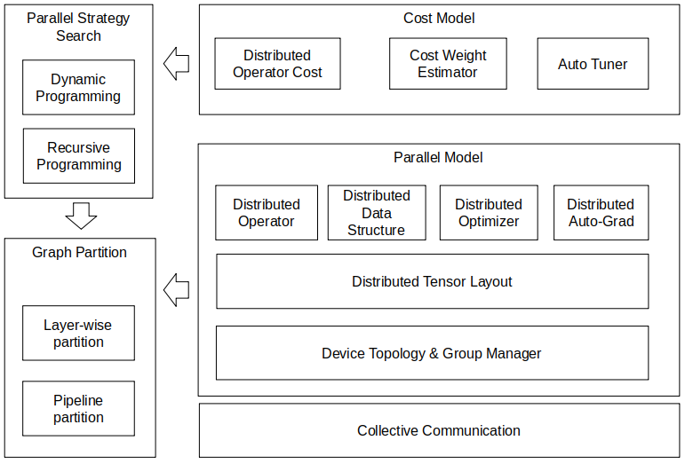

| title        | authors              | owning-sig | participating-sigs | status      | creation-date | reviewers | approvers | stage | milestone     |
| ------------ | -------------------- | ---------- | ------------------ | ----------- | ------------- | --------- | --------- | ----- | ------------- |
| MEP-PARALLEL | @stsuteng @xiaoda_zh | parallel   |                    | provisional | 2020-10-14    |           | TBD       | beta  | beta : "v0.5" |

# MEP-PARALLEL: Auto-parallel

## Table of Contents

<!-- toc -->

- [MEP-PARALLEL: Auto-parallel](#mep-parallel-auto-parallel)
  - [Table of Contents](#table-of-contents)
  - [Summary](#summary)
  - [Motivation](#motivation)
    - [Goals](#goals)
    - [Non-Goals](#non-goals)
  - [Proposal](#proposal)
    - [User Stories](#user-stories)
      - [Parallelizing training for general DNNs](#parallelizing-training-for-general-dnns)
  - [Design Details](#design-details)
    - [Test Plan](#test-plan)
  - [Implementation History](#implementation-history)
  - [Drawbacks](#drawbacks)
  - [Alternatives](#alternatives)
  - [References](#references)

  <!-- /toc -->

## Summary

<!--
This section is incredibly important for producing high quality user-focused
documentation such as release notes or a development roadmap.  It should be
possible to collect this information before implementation begins in order to
avoid requiring implementors to split their attention between writing release
notes and implementing the feature itself.  MEP editors, SIG Docs, and SIG PM
should help to ensure that the tone and content of the `Summary` section is
useful for a wide audience.

A good summary is probably at least a paragraph in length.

Both in this section and below, follow the guidelines of the [documentation
style guide]. In particular, wrap lines to a reasonable length, to make it
easier for reviewers to cite specific portions, and to minimize diff churn on
updates.

[documentation style guide]: https://gitee.com/mindspore/docs/blob/master/CONTRIBUTING_DOC.md
-->

Auto-parallel is a functionality built in MindSpore to automatically parallelize the training of giant DNN models. While keeping the DNN descriptions identical to their single-device counterparts, it algorithmically finds good partitioning strategy for the given model.

## Motivation

<!--
This section is for explicitly listing the motivation, goals and non-goals of
this MEP. Describe why the change is important and the benefits to users.
-->

It is increasingly important to find an efficient way to parallel train giant DNN models. However, there are multiple factors impacting the choice of parallel paradigms (Data-parallel, Model-parallel, and Hybird-parallel), including the size of training dataset, the size of the DNN model, the graph structure of the DNN model, the specification of hardware accelerators, etc. Different combinations of these factors prefer different parallel paradigms. It is desirable that a system takes these factors into account, and produces an efficient parallelization strategy for the given DNN model. 

### Goals

<!--
List the specific goals of the MEP. What is it trying to achieve? How will we
know that this has succeeded?
-->

- Easy use: The desired system should provide user-friendly interfaces. Ideally, parallel implementation is totally transparent to users.
- Good parallel speedup: The desired system can always find efficient parallelization strategy.

### Non-Goals

<!--
What is out of scope for this MEP? Listing non-goals helps to focus discussion
and make progress.
-->
- None

## Proposal

<!--
This is where we get down to the specifics of what the proposal actually is.
This should have enough detail that reviewers can understand exactly what
you're proposing, but should not include things like API designs or
implementation. The "Design Details" section below is for the real
nitty-gritty.
-->

Auto-parallel aims to automatically find efficient parallelization strategy for any DNN model, while keeping the DNN descriptions same as their single-device counterparts. To do so, it captures the data flow graph defined by a DNN model, and partitions the data flow graph after evaluating the cost of different partition strategies. **Cost model** provides the mechanism to estimate the cost under a given strategy. **Tensor partitioning** and **Pipelined model-parallel** are two paradigms to implement Model-parallel.

- **Cost model.**
  The choice of different strategies depends on their associated costs. The costs here can be defined as the iteration time in training, which includes both computation and communication time. In most cases, the computation and communication can be overlapped. Instead of taking engineering efforts to investigate cost of each operator under possible strategies, it is desired to estimate the cost according the semantic of the operator and its inputs.

- **Tensor partitioning.**
  Tensor partitioning is a paradigm to implement Model-parallel. In this paradigm, each tensor in the DNN model is partitioned into slices. The data flow graph obtained by each device is symmetric, meaning that the sequences of operators assigned onto devices are same. The problem is to find an efficient partition strategy for each tensor.

- **Pipelined model-parallel.** This is another paradigm to implement Model-parallel. In this paradigm, operators are assigned to different devices, while each operator itself is not partitioned. To address the low resource utilization problem, multiple training iterations can be active at the same time, so that the different batches are pipelined. The problem is to find a partition for the data flow graph.

### User Stories

<!--
Detail the things that people will be able to do if this MEP is implemented.
Include as much detail as possible so that people can understand the "how" of
the system. The goal here is to make this feel real for users without getting
bogged down.
-->

#### Parallelizing training for general DNNs
Since the DNNs used in different areas are significantly different, it is challenging to design a universal system that can always find the best parallelization strategies for the given DNN model. The Cost model and two paradigms are important components in our consideration. Proposals according to these components and other designs to solve the parallelization problem are welcome.

# Design Details

<!--
This section should contain enough information that the specifics of your
change are understandable. This may include API specs (though not always
required) or even code snippets. If there's any ambiguity about HOW your
proposal will be implemented, this is the place to discuss them.
-->

<!-- {:height="75%" width="75%"} -->

Auto-parallel consists of four main components:
- **Parallel model.** It provides the tensor layout (how each tensor is partitioned among devices), the distributed operator (the distributed counterpart of an operator), the distributed auto-grad (how to automatically generate derivatives of the distributed operators), etc.
- **Cost model.** It provides the interfaces of estimating cost of a distributed operator given a partition strategy. It also estimates cost of a tensor redistribution.
- **Parallel strategy search.** Given the data flow graph, it returns the parallelization strategy for each operator using the evaluations of **Cost model**.
- **Parallel partition.** Given the graph marked with strategy for each operator, it partitions the involved tensors for each operator, and it inserts necessary primitives to guarantee the correctness of partitioned operators.

### Test Plan

<!--
**Note:** *Not required until targeted at a release.*

Consider the following in developing a test plan for this enhancement:
- Will there be e2e and integration tests, in addition to unit tests?
- How will it be tested in isolation vs with other components?

No need to outline all of the test cases, just the general strategy. Anything
that would count as tricky in the implementation and anything particularly
challenging to test should be called out.

All code is expected to have adequate tests (eventually with coverage
expectations). Please adhere to the [MindSpore contributing guidelines][contributing-guidelines]
when drafting this test plan.

[contributing-guidelines]: https://gitee.com/mindspore/mindspore/blob/master/CONTRIBUTING.md
-->

There are two types of testing strategies in Auto-parallel:

- **Unit Test.** Every design for Auto-parallel should guarantee the correctness for each partitioned operator.

- **System test**. Every effective design should be tested for at least one real DNN model, so that the searched strategy indeed leads to efficient performance. Auto-parallel module provides some verifications and performance testing.

## Implementation History

<!--
Major milestones in the life cycle of a MEP should be tracked in this section.
Major milestones might include
- the `Summary` and `Motivation` sections being merged signaling SIG acceptance
- the `Proposal` section being merged signaling agreement on a proposed design
- the date implementation started
- the first MindSpore release where an initial version of the MEP was available
- the version of MindSpore where the MEP graduated to general availability
- when the MEP was retired or superseded
-->

- Support an preliminary implementation of **Parallel model** and **Parallel partition** module.
- Support an algorithm of **Parallel strategy search** module.
- Support an preliminary implementation of **Cost model**. 
- Enhance **Parallel partition** and **Parallel strategy search** module to support searching efficient strategy for a series of ResNet DNN models.
- Enhance **Cost model** module to precisely characterize memory cost, computation cost and communication cost.

## Drawbacks

<!--
Why should this MEP _not_ be implemented?
-->
- Currently, the searched strategy returned by Auto-parallel may not always lead to the best iteration time. This is mainly due to the **Cost model** improperly estimates the execution cost of operators and entire models.

## Alternatives

<!--
What other approaches did you consider and why did you rule them out? These do
not need to be as detailed as the proposal, but should include enough
information to express the idea and why it was not acceptable.
-->
- Mesh-TF[1] partitions the data flow graph to minimize the memory consumption of each device. However, Mesh-TF may be suboptimal in end-to-end iteration time since it misses tensor redistribution strategies between two adjacent operators. 
OptCNN[2] and Tofu[3] includes the tensor redistribution strategies, but they have problems when the data flow graph has complex graph structures. The algorithm in current Auto-parallel considers the tensor redistributions, and is able to deal with complex graph structures.
- The above works follow the **Tensor partitioning** paradigm. While GPipe[4] and PipeDream[5] are two implementations of **Pipelined model-parallel** paradigm. We are considering a hybrid design of combining these two paradigms.
## References
- [1] Noam Shazeer, Youlong Cheng, Niki Parmar, Dustin Tran, Ashish Vaswani, Penporn Koanantakool, Peter Hawkins, HyoukJoong Lee, Mingsheng Hong, Cliff Young, Ryan Sepassi, and Blake Hechtman. Mesh-TensorFlow: Deep Learning for Supercomputers. NeurIPS '18.
- [2] Zhihao Jia, Sina Lin, Charles R. Qi, and Alex Aiken. Exploring Hidden Dimensions in Accelerating Convolutional Neural Networks. ICML '18.
- [3] Minjie Wang, Chien-chin Huang, and Jinyang Li. Supporting Very Large Models Using Automatic Dataflow Graph Partitioning. EuroSys '19.
- [4] Yanping Huang, Youlong Cheng, Ankur Bapna, Orhan Firat, Dehao Chen, Mia Chen, HyoukJoong Lee, Jiquan Ngiam, Quoc V Le, Yonghui Wu, and zhifeng Chen. GPipe: Efficient Training of Giant Neural Networks using Pipeline Parallelism. NeurIPS '19.
- [5] Deepak Narayanan, Aaron Harlap, Amar Phanishayee, Vivek Seshadri, Nikhil R. Devanur, Gregory R. Ganger, Phillip B. Gibbons, and Matei Zaharia. PipeDream: Generalized Pipeline Parallelism for DNN Training. SOSP '19.