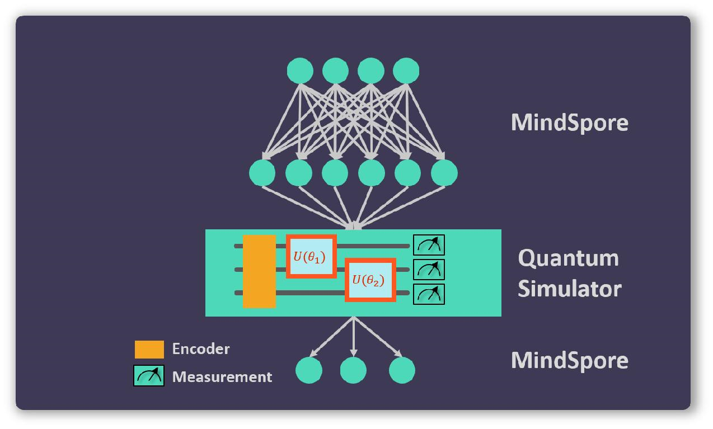

| title | authors | owning-sig | participating-sigs | status | creation-date | reviewers | approvers | stage | milestone |
| ----- | ------- | ---------- | ------------------ | ------ | ------------- |---------- | --------- | ----- | --------- |
| MEP-QUANTUM | @donghufeng, @kangyangzc  | wg-quantum | sig-parallel | provisional | 2021-01-19 | TBD | TBD | NA | "v1.0" |

# MEP-QUANTUM: MindSpore QUANTUM

## Table of Contents

<!-- toc -->

- [Summary](#summary)
- [Motivation](#motivation)
    - [Goals](#goals)
    - [Non-Goals](#non-goals)
- [Proposal](#proposal)
    - [User Stories](#user-stories)
- [References](#references)

<!-- /toc -->

## Summary

Quantum computing is a disruptive approach to go beyond the capability of classical computers in the Post-Moore era. In 2019, quantum computational supremacy was experimentally demonstrated[1], meaning that the existing quantum chips can be used to perform certern tasks much faster than all classical computers. The next step is to find practical applications for these quantum chips, where machine learning is a natural choice. In fact, quantum machine learning is a fast-growing research area combining both quantum computation and classical machine learning, which can potentially achieve breakthroughs for both fields of research. The Quantum WG aims to foster a community for solving both classical and quantum problems by a collaboration in building a software framework for quantum machine learning.

## Motivation

Based on a variety of quantum properties, including coherence, superposition parallelism etc., quantum computers can achieve exponential speedups for many computational problems. In recent years, lots of important quantum-machine-learning algorithms have been invented, for example, HHL algorithm for solving linear equations [2], quantum principal component analysis (Q-PCA) [3], quantum support vector machine (Q-SVM) [4], quantum neural network (QNN) [5], etc. However, we are currently in the era of NISQ ( Noisy Intermediate-Scale Quantum ) [6], where the number of qubits and the accuracy of quantum gates are not good enough for implementing these quanutm algorithms. To overcome such challenge, we may consider the approach of variational quantum algorithm [7], which are expected to be capable of achieving quantum superiority in the NISQ stage.

MindSpore is a powerful deep learning framework which can provides user-friendly APIs, operator fusion and auto-paralleling capabilities, supporting CPU, Ascend and GPU backends. We can combine classical machine learning with quantum algorithms to build a quantum-classical hybrid architecture, allowing users to build their own QNNs conveniently. In addition, we can also use MindSpore to solve quantum problems with classic machine learning algorithms for the purpose of quantum control.

### Goals

The goals of this project are as follows:

- To design a user-friendly programming and API for the implementation of quantum neural network (QNN).

- To develop a high-performance quantum simulator that can support the simulation of quantum circuit wwith 50 or more qubits.

- To build a reinforcement learning framework for optimizing quantum control.

### Non-Goals

- None.

## Proposal

To address the limitations of existing quantum-machine-learning framework, proposals and contributions on the following aspects are welcome.

- **Friendly programming API.** The MindSpore quantum will be compatible with MindSpore's deep-learning framework. The developers can naturally use the existing operators and optimizers in MindSpore to train hybrid quantum-classical neural network.

- **Rich library of quantum models.** Based on the current quantum neural network framework, more quantum models will be developed, such as quantum convolutional neural network and quantum graph neural network.

- **High performance simulation backend.** With the increase of quantum qubits, the quantum state we need to handle increase exponentially, as well as the simulation process. To increase our simulation performance, more backends should be implemented, such as Ascend and GPU. Moreover, tensor network is also an approach to simulate quantum circuit with less time consuming.

### User Stories

Quantum neural network can be described by quantum circuit model. A quantum circuit is composed of quantum qubits, quantum gates and measurements. The quantum qubits are implemented by different quantum systems, such as Josephson junction, trapped ion, NV center, etc. For a quantum system with $n$ qubits, the quantum state vector is in a
$2^n$ dimension Hillbert space. Quantum gates are represented by quantum operators that act on these quantum qubits. There are two kinds of quantum gates, non-parameterized gate and parameterized gate. The Pauli gate $X, Y, Z$, hadamard gate $H$ and CNot gate are commonly used in the non-parameterized gate set. On the other hand, the parameterized gates are trainable in a quantum circuit. Rotation-X gate $\text{Rx}(\theta)$ is one of them, for example, and we can adjust the rotation angle $\theta$ by the expectation value of measurements. The measurements applied on the end of quantum circuit will return the probability of the quantum state collapsed on certain bit strings.

Figure 1[8] shows a basic structure of parameterized quantum circuit operator in MindSpore. Here we have 8 quantum qubits, and the measurement is applied to the first qubit. The whole quantum circuit is construct by a encoding circuit $U(\rho_{\text{in}})$, which will prepare the quantum system in a certain initial state, and an ansatz circuit combined by CNOT gate and Rotation gate, with rotation angle can be trained by MindSpore.

By specially designing the QNN, one can feed data into this layer with the encoding circuit and train the ansatz with optimizers, or connect the QNN layer with a classic neural network, as shown in figure 2. The forward and backward propagation of QNN are automatically implement in the MindSpore pipelines. Since the quantum gates can be represented by unitary matrices, the QNN will naturally be an invertible neural network, which dramatically reduced the calculation time of gradient.

### References

[1] Arute F, Arya K, Babbush R, et al. Quantum supremacy using a programmable superconducting processor[J]. Nature, 2019, 574(7779): 505-510.

[2] Harrow A W, Hassidim A, Lloyd S. Quantum algorithm for linear systems of equations[J]. Physical review letters, 2009, 103(15): 150502.

[3] Lloyd S, Mohseni M, Rebentrost P. Quantum principal component analysis[J]. Nature Physics, 2014, 10(9): 631-633.

[4] Rebentrost P, Mohseni M, Lloyd S. Quantum support vector machine for big data classification[J]. Physical review letters, 2014, 113(13): 130503.

[5] Kak S C. Quantum neural computing[M]//Advances in imaging and electron physics. Elsevier, 1995, 94: 259-313.

[6] Preskill J. Quantum Computing in the NISQ era and beyond[J]. Quantum, 2018, 2: 79.

[7] Peruzzo A, McClean J, Shadbolt P, et al. A variational eigenvalue solver on a photonic quantum processor[J]. Nature communications, 2014, 5: 4213.

[8] Zhang K, Hsieh M H, Liu L, et al. Toward trainability of quantum neural networks[J]. arXiv preprint arXiv:2011.06258, 2020.
