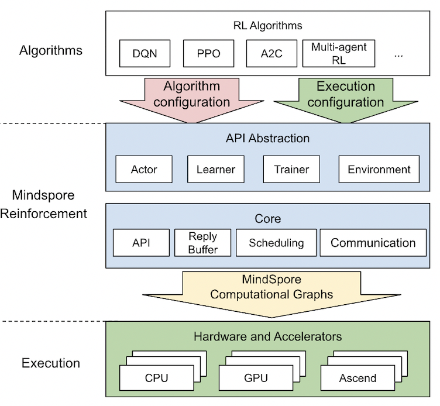

| title | authors | owning-sig | participating-sigs | status | creation-date | reviewers | approvers | stage | milestone |
| ----- | ------- | ---------- | ------------------ | ------ | ------------- |---------- | --------- | ----- | --------- |
| MEP-REINFORCEMENT | @Rongpeng Li, @Peter | reinforcement |  | provisional | 2022-02-15 | TBD | TBD | NA | "v0.1" : "v0.2" |

# MEP-REINFORCEMENT: MindSpore REINFORCEMENT

## Table of Contents

<!-- toc -->

- [Summary](#summary)
- [Motivation](#motivation)
    - [Goals](#goals)
    - [Non-Goals](#non-goals)
- [Proposal](#proposal)
    - [User Stories](#user-stories)
- [References](#references)

<!-- /toc -->

## Summary

MindSpore Reinforcement is an open-source reinforcement learning framework that supports the distributed training of agents using reinforcement learning algorithms. The Reinforcement Learning SIG will focus on the practical implementation and continuous evolution of RL support in MindSpore and stimulate the research interest in RL algorithms supported by MindSpore Reinforcement.

## Motivation

Reinforcement learning (RL) is a machine learning method based on rewarding desired behaviors and/or punishing undesired ones. An RL agent is capable of perceiving and interpreting its environment, taking actions, and learning through trial and error. The popularity of RL has surged, and it has been applied in numerous contexts, after the well-publicized success of the AlphaGo game-playing AI.

Currently, the simulation and application of RL algorithms using traditional AI frameworks such as TensorFlow and PyTorch is cumbersome by adhering to rigid inflexible APIs and requires manual effort by repeatedly writing boilerplate framework code. MindSpore Reinforcement will support scalable distributed multi-agent RL training across heterogeneous devices, while offering an intuitive algorithmic programming abstraction. For the future successful evolution of MindSpore Reinforcement, feedback from the user community and advocacy for the library will be essential.

### Goals

- Accelerate the practical implementation and continuous evolution of MindSpore Reinforcement Learning.

- Share updates on research progress related to RL algorithms, multi-agent RL (e.g., cooperative and competitive), RL scalability and performance, etc.

- Organize webinars/seminars/workshops/conferences about RL algorithms and scalable RL training using MindSpore Reinforcement.

- Facilitate interactions between users, developers and researchers of MindSpore Reinforcement.

- Build up an open platform to compare RL algorithms from the community.

### Non-Goals

- None.

## Proposal

To address the limitations of existing reinforcement frameworks, proposals and contributions on the following aspects are welcome.

- **Programming framework.** The programming framework contains the algorithm Python API such as actor, learner, as well as core components such as replay buffer, policy, etc.

- **RL algorithm examples.** The reinforcement repository provides an algorithm library that implements some commonly used RL algorithms, and more algorithms will be added in the future.

- **Simulation environments.** Common environments such as gym, mujoco, etc., the diverse simulation environments and higher sampling efficiency are helpful for the research and application of reinforcement learning.

- **Performance improvement of training.** Training performance is affected by many factors, including operator performance, optimization of cross-process communication, etc. Any improvement in performance is welcome.

### User Stories

#### Reinforcement Learning Algorithm Development And Multi-Agent Distributed Training

MindSpore Reinforcement offers a clean API abstraction for writing reinforcement learning algorithms, which decouples the algorithm from deployment and execution considerations, including the use of accelerators, the level of parallelism and the distribution of computation across a cluster of workers. The Python programming API contains a series of abstractions for RL algorithms, mainly including actor, learner, agent, trainer and some core components such as replay buffer.

MindSpore Reinforcement translates the reinforcement learning algorithm into a series of compiled computational graphs, which are then run efficiently by the MindSpore framework on CPUs, GPUs and Ascend AI processors. This initial release of MindSpore Reinforcement contains a stable API for implementing reinforcement learning algorithms and executing computation using MindSpore's computational graphs. It does not yet include the more advanced features for the parallel and distributed execution of algorithms or the support for multi-agent scenarios with cooperating and competing agents - stay tuned for future releases of MindSpore Reinforcement that will include these features.

### References

[1] Eric Liang, Richard Liaw, Robert Nishihara, Philipp Moritz, Roy Fox, Ken Goldberg, Joseph Gonzalez, Michael Jordan, and Ion Stoica. Rllib: Abstractions for distributed reinforcement learning. In International Conference on Machine Learning, 2018.

[2] Matt Hoffman, Bobak Shahriari, John Aslanides, Gabriel Barth-Maron, Feryal Behbahani, Tamara Norman, Abbas Abdolmaleki, Albin Cassirer, Fan Yang, Kate Baumli, Sarah Henderson, Alex Novikov, Sergio Gómez Colmenarejo, Serkan Cabi, Caglar Gulcehre, Tom Le Paine, Andrew Cowie, Ziyu Wang, Bilal Piot, and Nando de Freitas. Acme: A research framework for distributed reinforcement learning, 2020.

[3] Philipp Moritz, Robert Nishihara, Stephanie Wang, Alexey Tumanov, Richard Liaw, Eric Liang, Melih Elibol, Zongheng Yang, William Paul, Michael I Jordan, et al. Ray: A distributed framework for emerging {AI} applications. In 13th {USENIX} Symposium on Operating Systems Design and Implementation ({OSDI} 18), 2018.

[4] Pablo Samuel Castro, Subhodeep Moitra, Carles Gelada, Saurabh Kumar, and Marc G. Bellemare. Dopamine: A research framework for deep reinforcement learning. CoRR, 2018.

[5] Michael Schaarschmidt, Sven Mika, Kai Fricke, and Eiko Yoneki. RLgraph: Modular Computation Graphs for Deep Reinforcement Learning. In Proceedings of the 2nd Conference on Systems and Machine Learning (SysML), 2019.

[6] Tian Lan, Sunil Srinivasa, Huan Wang, Stephan Zheng. WarpDrive: Extremely Fast End-to-End Deep Multi-Agent Reinforcement Learning on a GPU. 2021.

[7] Matteo Hessel, Manuel Kroiss, Aidan Clark, Iurii Kemaev, John Quan, Thomas Keck, Fabio Viola, Hado van Hasselt. Podracer architectures for scalable Reinforcement Learning. 2021.