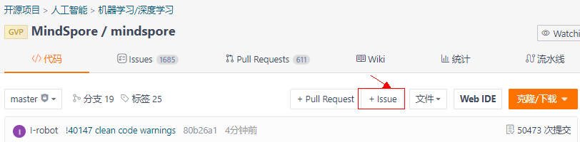
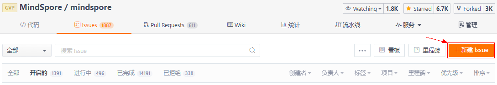
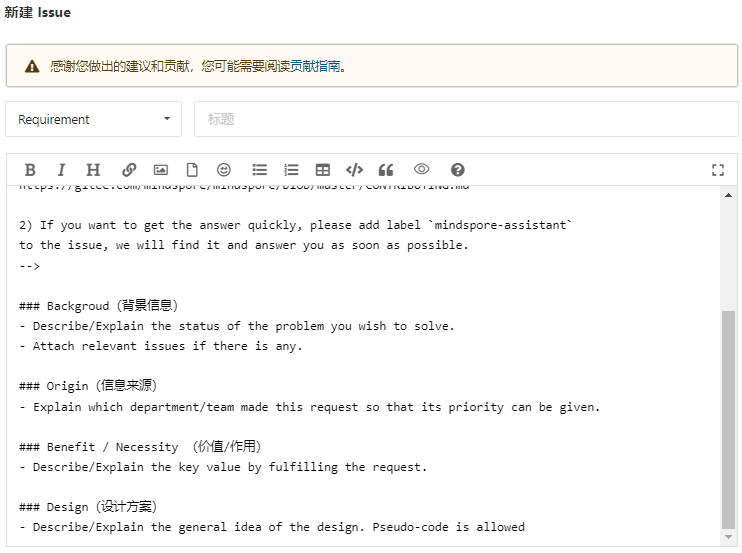
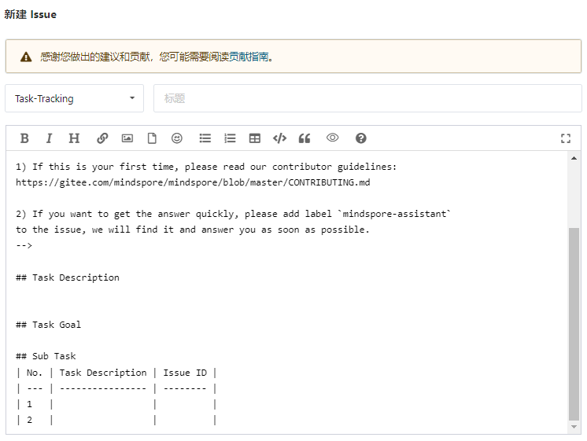
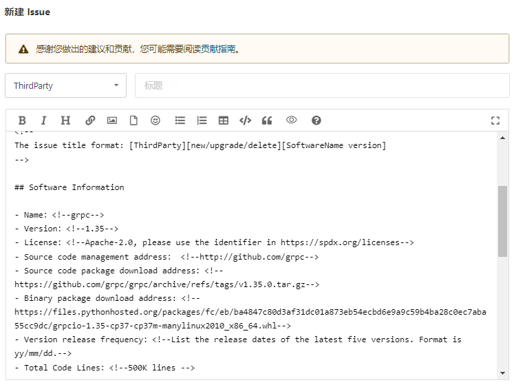
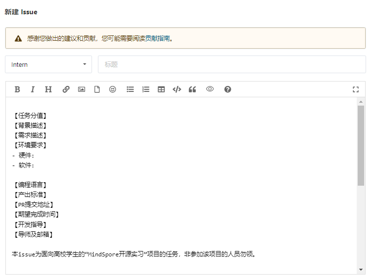
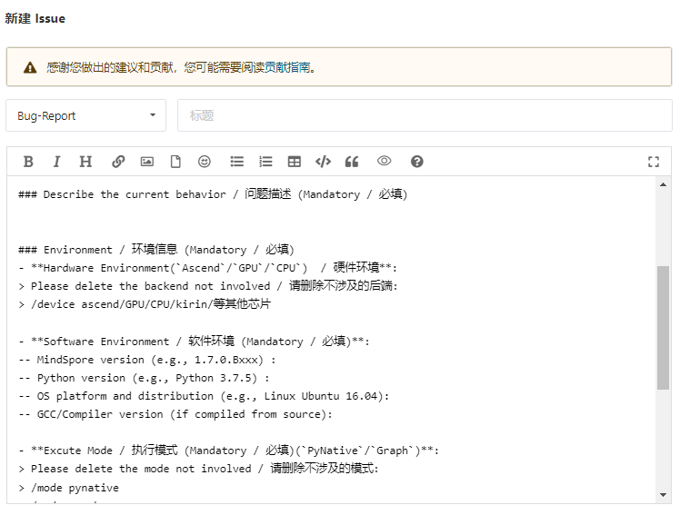

# Issue处理指南（草稿）

Issue是开源社区用于一个问题跟踪（需求、任务、缺陷等）的主要手段，其背后主要依托于Gitee或者Github开源软件托管平台的能力。

## Issue创建方式入口

通常情况下，社区Issue主要通过选择某个具体仓库进行创建，以gitee为例：

- 方式一：选择某个代码仓，在代码页签下，点击“+Issue”按钮进行创建：



- 方式二：选择某个代码仓，在Issues页签下，点击”+新建 Issue“按钮进行问题创建：



## Issue创建类型选择

### 需求类模板


### 任务类模板

#### 普通任务



#### 开源软件引入

主要用于MindSpore项目开发或者运行过程依赖的开源软件选型，选型要求参考[MindSpore 软件包依赖管理规范(试行稿)]
(https://gitee.com/mindspore/community/blob/master/security/software-management_zh_cn.md)


#### 实习任务

主要用于MindSpore社区开源实习任务的跟踪。

### 缺陷类模板


## 各类ISSUE处理流程

### 需求类处理流程

1. 新建ISSUE（TODO），权限范围：社区成员/普通用户
- 填写需求标题：对需求名称做简要描述，例如：【控制流】if语句支持三阶自动微分；
- 填写需求内容：根据模板描述指导填写具体内容；
2. 拒绝ISSUE（TODO→REJECTED），权限范围：社区成员
- 在ISSUE评论区中给出合理的拒绝理由，与@提交者确认后拒绝此ISSUE。
3. 接受ISSUE（TODO→ACCEPTED），权限范围：社区成员
- 设置需求负责人及协作者；
- 设置需求关联项目：未明确的优先放入MindSpore REQ Tracking System，明确后纳入MindSpore Iteration Management。
- 设置需求开始日期和截止日期
- 设置需求优先级：严重/主要/次要/不重要；
- 设置需求验收标准：stable/beta/demo

| 验收标准 | 简要描述 |
| ------------ | ------------ |
| stable | 标准特性：场景泛化性支持较完备，可以满足不同场景诉求，功能使能，代码可以合入 |
| beta | 实验特性：只能满足特性场景的使用，受限使用，功能使能，代码可以合入 |
| demo | 预研特性：接口不对外提供，功能不能使能，代码可以合入；若前2个要求不满足，则不能合入 |

- 设置里程碑

- 设置分支

4. 处理ISSUE（ACCEPTED→WIP），权限范围：社区成员
- 若需求验收标准为stable/beta，需要组织设计评审（开发输出设计方案、测试输出验收方案），开发结束后在评论区提供自验证结果说明；若ISSUE验收标准为demo，开发结束后在评论区说明整体完成情况、开发自验证结果；
5. 验收ISSUE（WIP→VALIDATION），权限范围：社区成员
- 若需求验收标准为stable/beta，设置ISSUE负责人为验收者。
6. 关闭ISSUE（WIP→DONE），权限范围：社区成员
- 若需求验收标准为demo，在ISSUE评审中附上开发自验收结果，关闭ISSUE。
7. 打回ISSUE（VALIDATION→WIP），权限范围：社区成员
- 若需求验收标准为stable/beta，验收存在基本功能问题，在评论区说明驳回原因，将ISSUE驳回（修改状态为WIP，ISSUE负责人修改为开发者），继续开发验证。
8. 关闭ISSUE（VALIDATION→DONE），权限范围：社区成员
- 若需求验收标准为stable/beta，在ISSUE评论区中附上验收结果，关闭ISSUE。

### 缺陷类处理流程

1. 新建ISSUE（TODO），权限范围：社区成员/普通用户
- 填写缺陷标题：1）开发提单：[MS/MI/MD/MA…][网络名/特性名/算子名]xxxxx；2）测试提单：[UT/CT/ST/MDT/LITE][MS/MI/MD/MA…][网络名/特性名/算子名]xxxx。
- 填写缺陷内容：根据模板描述指导填写具体内容；

**若缺陷分析明确，可以提前补充以下内容：**

- 设置缺陷负责人及协作者；
- 设置缺陷关联项目：例如，MindSpore Bug Tracking System。
- 设置缺陷优先级：严重/主要/次要/不重要；
- 设置里程碑，例如：B-SIG-Compiler
- 设置分支

2. 拒绝ISSUE（TODO→REJECTED），权限范围：社区成员
- 在ISSUE评论区中给出合理的拒绝理由，与@提交者确认后拒绝此ISSUE。

3. 接受ISSUE（TODO→ACCEPTED），权限范围：社区成员
- 设置缺陷开始日期和截止日期

**若以下信息未在TODO阶段明确，则需要在此阶段更新：**

- 设置缺陷负责人及协作者；
- 设置缺陷关联项目：例如，MindSpore Bug Tracking System。
- 设置缺陷优先级：严重/主要/次要/不重要；
- 设置里程碑，例如：B-SIG-Compiler
- 设置分支

参考样例：[https://gitee.com/mindspore/mindspore/issues/I5LBGV?from=project-issue](参考样例)

4. 处理ISSUE（ACCEPTED→WIP），权限范围：社区成员
- 在评论区给出问题根因分析及提供初步问题解决方案，评论区格式如下：

```text
# Appearance & Root Cause
xxxxx
# Fix Solution
xxxxx
```

5. 验收ISSUE（WIP→VALIDATION），权限范围：社区成员
- 问题修复，给出修复说明并给出测试建议，并指派给缺陷验收责任人。

```text
# Fix Description & Test Suggestion
xxxxx
# Self-test Report
xxxxx
# Suggested regression version
xxxxx
```

6. 打回ISSUE（VALIDATION→WIP），权限范围：社区成员
- 若缺陷验收不通过，将ISSUE驳回（修改状态为WIP，ISSUE负责人修改为开发者），继续修复。

7. 关闭ISSUE（VALIDATION→DONE），权限范围：社区成员
- 在ISSUE评论区中附上验收结果，关闭ISSUE。

```text
Regression Version ：commit id
Regression Step ：1.xxx 2.xxx
Regression Result ：要有对应回归截图
Regression Conclusion ：通过
```
