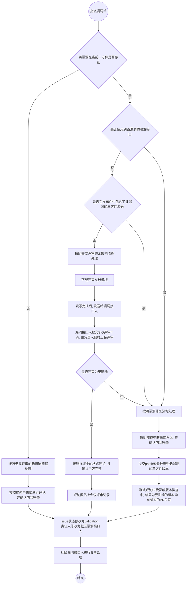

# 开源社区三方件漏洞处理指导

```mermaid
graph TD;
    A((指派漏洞单)) --> B{该漏洞在当前三方件是否存在};
    B --> |否| C[按照无需评审的无影响流程处理];
    B --> |是| D{是否使用到该漏洞的触发接口};
    D --> |否| E{是否在发布件中包含了该漏洞的三方件源码};
    D --> |是| F[按照漏洞修复流程处理];
    E --> |否| G[按照需要评审的无影响流程处理];
    E --> |是| F;
    C --> H[按照描述中格式进行评论, 并确认内容完整];
    H --> I[issue状态修改为validation, 责任人修改为社区漏洞接口人];
    I --> J[社区漏洞接口人进行关单处理];
    J --> K((结束));
    G --> L[下载评审文档模板];
    click L "https://gitcode.com/mindspore/community/blob/master/security/Security_Assessment_Report.docx"
    L --> M[填写完成后, 发送给漏洞接口人];
    M --> N[漏洞接口人提交SIG评审申请, 由负责人到时上会评审];
    N --> O{是否评审为无影响};
    O --> |是| P[按照描述中的格式评论, 并确认内容完整];
    P --> Q[评论区贴上会议评审记录];
    Q --> I;
    O --> |否| F;
    F --> R[按照描述中的格式评论, 并确认内容完整];
    R --> S[提交patch或者升级到无漏洞的三方件版本];
    S --> T[确认评论中受影响版本排查中, 结果为受影响的版本均有对应的PR关联];
    T --> I;
```
