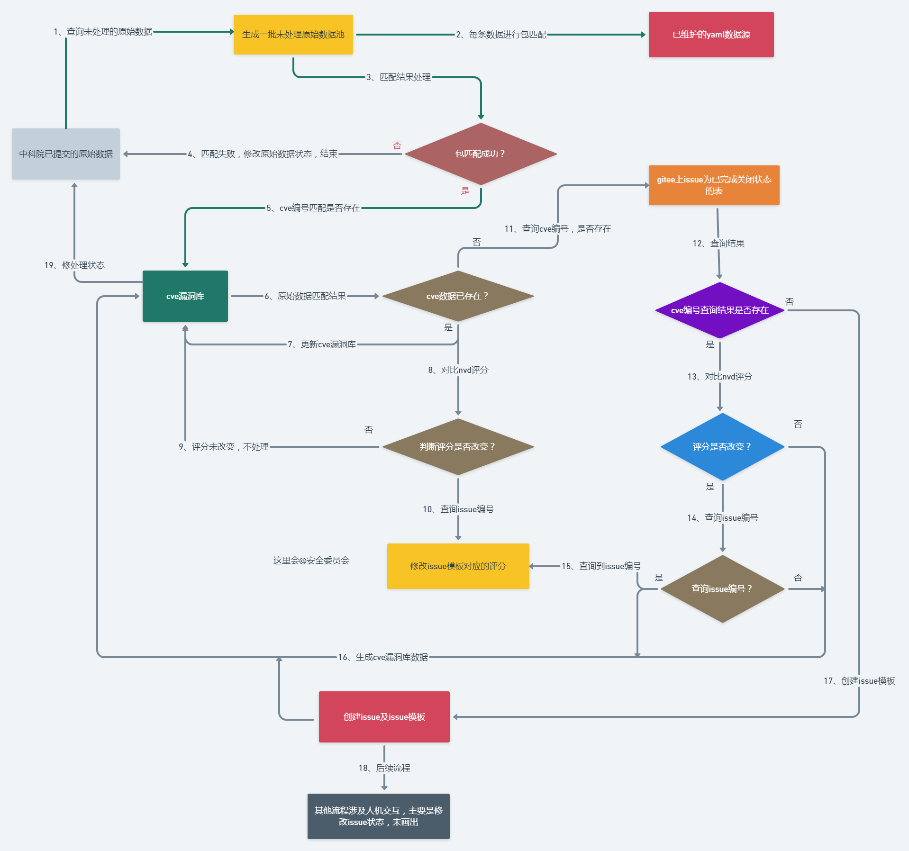

## issue分析说明

### issue分析触发流程图



#### issue 分析评论流程

issue分析注意事项

- 所有人都可以在评论区对issue进行分析
- 分析issue模板并拷贝以下内容在**评论区回复**：

    ```text
    影响性分析说明:

    MindSpore评分: (评分和向量)

    受影响版本排查(受影响/不受影响):
    1.v1.2.0:
    2.v.1.2.1:
    ```

- 受影响版本排查(受影响/不受影响)填写说明(未引入分支不需要填写)：

    ```text
    1>issue模板或第一条评论中不包含 如：1.v1.2.0:之类的填写项则不需要填写，
      如issue处理人发现有对应的版本需要填写则参考下方说明格式填写
    2>填写方式：
       1.v1.2.0:受影响
       2.v1.2.1:不受影响
    ```

 - 分析内容可一次性填写完整也可分条填写
 - 重复分析内容可覆盖上一次分析的内容（填写方式依据的key/value格式，key不能省略）
 - cve-manage 在每次分析评论提交后根据内容进行解析并根据解析后的内容进行回复，issue处理人在评论后没得到回复可主动刷新页面或有延迟
 - 当内容填写完整会触发两种回复中的一种：

    1.评分不一致需要审核

    | 状态  | 需分析            | 内容                     |
    |-----|----------------|------------------------|
    | 已分析 | MindSporeScore | 6.0                    |
    | 已分析 | 影响性分析说明        | 您分析的内容                 |
    | 已分析 | MindSporeVector | AV:A/AC:C...           |
    | 已分析 | 受影响的版本         | v1.2.0:受影响 |

     **在关闭issue前，issue责任人请查看模板中nvd评分和MindSpore评分是否一致，存在问题请在issue评论区重新填写**

### 审核员操作说明

- 安全委员会对issue处理人填写完整的issue和已关联pr(受影响的分支)可在issue的评论区回复如下指令
- 使用指令说明

    | 指令 | 指令说明 | 使用权限 |
    | ------ | ------- | ------- |
    | /approve | 审核通过 | security-sig组成员 |

- 注意事项

    ```text
    1.指令独占一行
    2.以最后一位审核员评论审核的指令为最终指令
    3.审核评论成功 cve-manage 会新增一条@责任人的评论
      （若没有新增评论，可主动刷新页面，多次刷新后没有回复则没有审核评论成功）
    ```

### issue关闭

- issue处理人需要审核模板内容是否填写正确
- 审核nvd评分和MindSpore评分是否符合要求
- issue中受影响的分支是否全部关联pr
- 在issue界面手动修改issue状态为closed或者在当前issue的评论区回复如下指令
- 使用指令说明

   | 指令 | 指令说明 | 使用权限 |
   | ------ | ------- | ------- |
   | /approve | 审核通过 | security-sig组成员 |