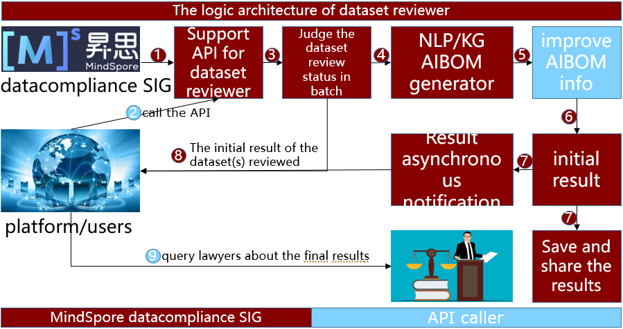
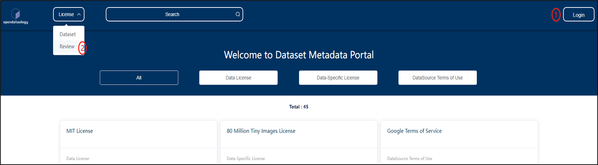
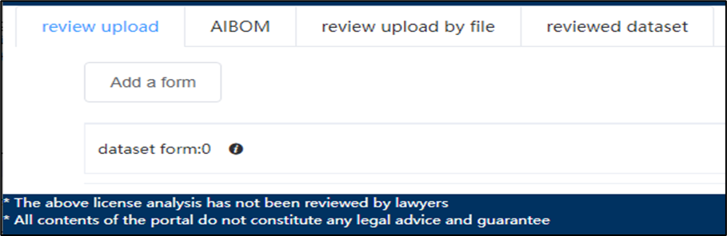
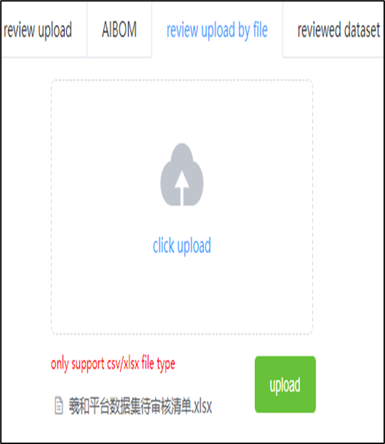
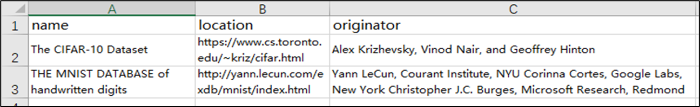
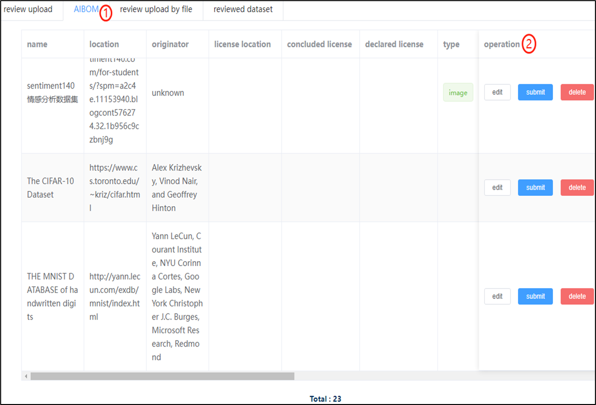
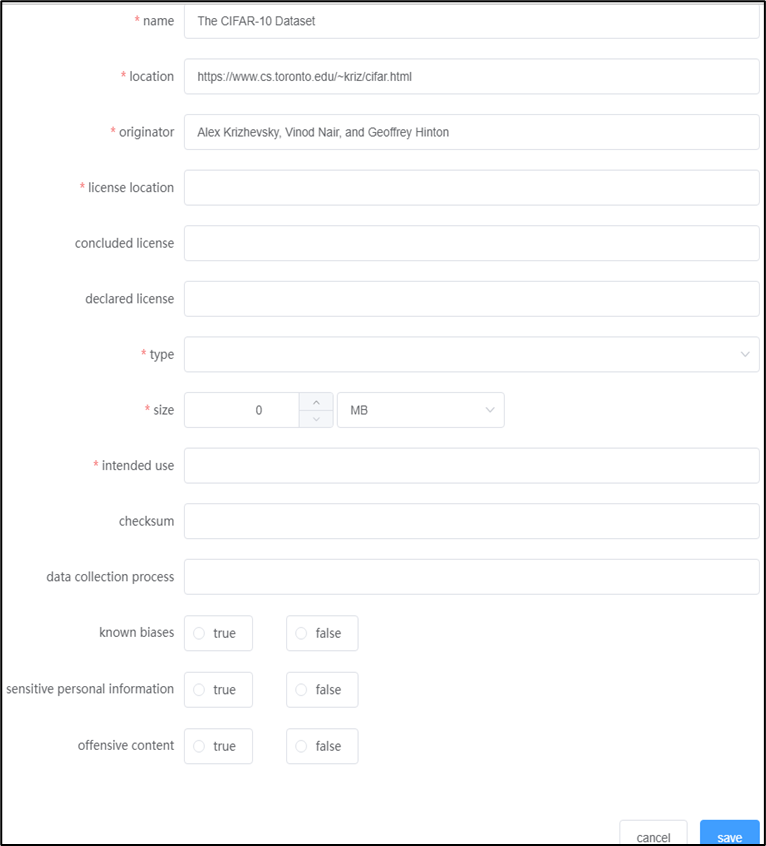
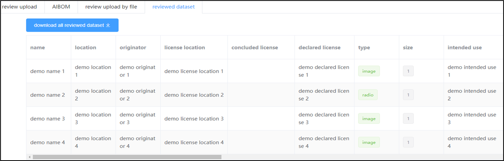
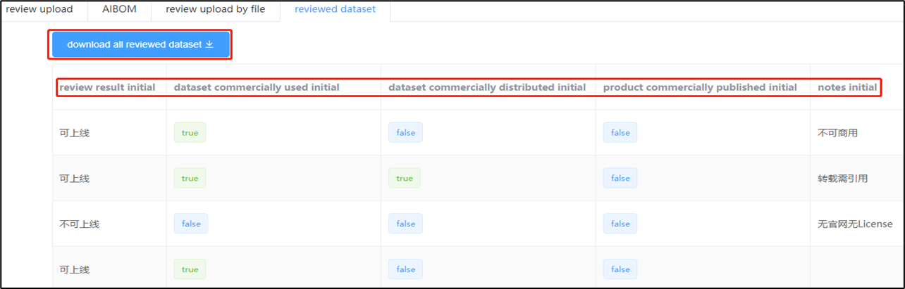

# The user guide for dataset reviewer

## Table of contents

1. **[The logic architecture of dataset reviewer](#1.%20The%20logic%20architecture%20of%20dataset%20reviewer)**
2. **[The entrance of dataset reviewer](#2.%20The%20entrance%20of%20dataset%20reviewer)**
3. **[The module introduction of dataset reviewer](#3.%20The%20module%20introduction%20of%20dataset%20reviewer)**
4. **[Single or batch datasets uploading](#4.%20Single%20or%20batch%20datasets%20uploading)**
5. **[AIBOM info supplement and maintenance](#5.%20AIBOM%20info%20supplement%20and%20maintenance)**
6. **[Preview or download the result of all datasets reviewed](#6.%20Preview%20or%20download%20the%20result%20of%20all%20datasets%20reviewed)**

## 1. The logic architecture of dataset reviewer

## 2. The entrance of dataset reviewer

- In the [dataset information sharing platform](http://www.opendataology.com:30800/), click the top-right button to login and jump to the dataset reviewer via the `` Review`` button

## 3. The module introduction of dataset reviewer

- Review upload: single dataset uploading supported.
- Review upload by file: batch datasets uploading supported.
- AIBOM: AIBOM info supplement and maintenance.
- Reviewed dataset: download the result of all datasets reviewed.

## 4. Single or batch datasets uploading

- Review upload (single dataset uploading): submit for review by filling in the name, location, and originator of a single dataset.
- Review upload by file (batch datasets uploading): add items in batch in Excel or CSV template.
- name: dataset name.
- location: dataset official website.
- originator: contributor list, separated by one pair of a comma and a space.

### 4.1 Single dataset uploading

### 4.2 Batch datasets uploading

## 5. AIBOM info supplement and maintenance

- Preview the AIBOM properties of the datasets on ``AIBOM`` page.
- edit: supplement or maintain AIBOM information of dataset and save it.
- submit: confirm the AIBOM information of the dataset to be reviewed and submit it to the reviewer side.
- delete: no need to review this dataset and can be deleted directly.

### 5.1 Click edit to supplement the necessary attribute details of the dataset AIBOM format

- name*: dataset name
- location*: dataset official website
- originator*: contributor list, separated by one pair of a comma and a space.
- license location*: license location
- concluded license: The license that is confirmed in the [SPDX License List](https://spdx.org/licenses).
- declared license: The customized license content that is not confirmed in the [SPDX License List](https://spdx.org/licenses), such as license, term of use, citation, reference, and other keywords.
- type*: The dataset type.
- size*: The dataset size.
- intended use*: The official purpose why this dataset is collected or used.
- checksum: Same as the name ``checksum``.
- data collection process:  Same as the name ``data collection process``.
- known biases: Whether any biases existed.
- sensitive personal information: Whether any sensitive personal information contained.
- offensive content: Whether any offensive content contained.
- rejection notes: The reason why this dataset AIBOM is rejected.

Notes: concluded license and declared license cannot be null in the meanwhile.

## 6. Preview or download the result of all datasets reviewed

- Download the datasets that have been reviewed through the initial stage.
- review result*: the initial result that determine whether this dataset can be put online or not (After the initial result, users must query lawyers about the final result).
- dataset commercially used*: Whether this dataset can be commercially used or not.
- dataset commercially distributed*: Whether this dataset can be commercially distributed or not.
- product commercially published*: Whether this dataset can be commercially published or not.
- notes: Other notes of the initial result.