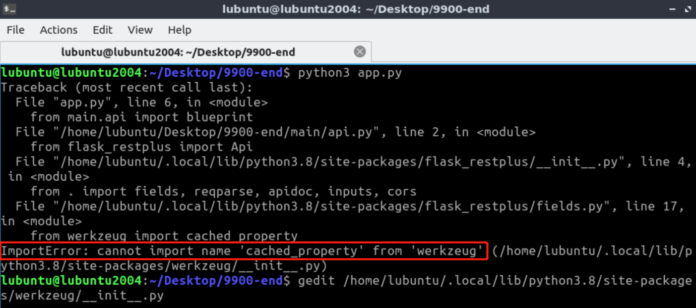
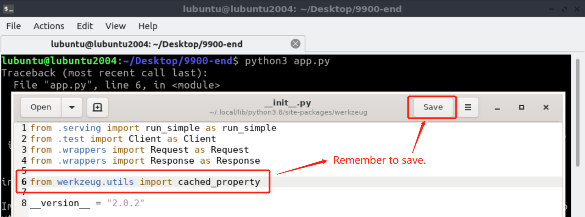
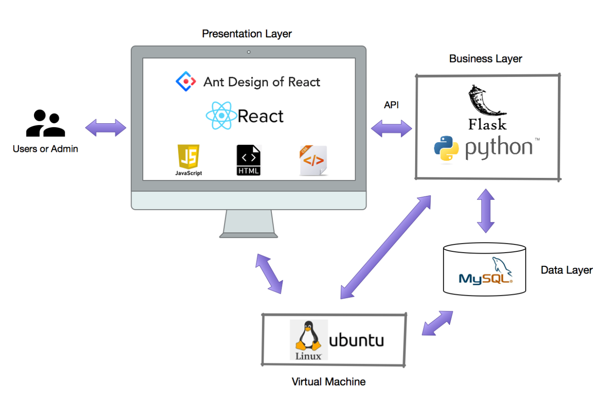

# Env Installation

## Option 1. Run with docker + k8s

```sh
cd ServiceSet
docker build -t docker_account/service-set:0.1 ./ --no-cache
docker run -it --name service-set -p 9216:8080  quzicheng/service-set:0.1
```

## Option 2. Install the env and start the service locally

```sh
cd ServiceSet
sudo apt update
pip3 install -r requirements.txt # Based on Python 3.8.0
python3 app.py
```

If this error occurs ```ImportError: cannot import name 'cached_property' from 'werkzeug'```, please import ```cached_property``` in ```werkzeug```.

Add the import in ```werkzeug/__init__.py``` as followings:





```sh
# This path depends on the actually path of your file, please check the prompt in the ImportError.
vim /absolute_path/werkzeug/__init__.py
```

```py
from werkzeug.utils import cached_property
```

```sh
# general path reference for werkzeug/__init__.py
The file path on CentOS：/usr/local/lib/python3.8/site-packages/werkzeug/__init__.py
The file path on Unbutu：/usr/local/lib/python3.8/dist-packages/werkzeug/__init__.py
The file path on MacOS：/usr/local/lib/python3.8/site-packages/werkzeug/__init__.py
```

## The architecture for the OpenDataology backend.



The main development language is Python3.8.0，based on Linux, with Flask and MySQL adopted.