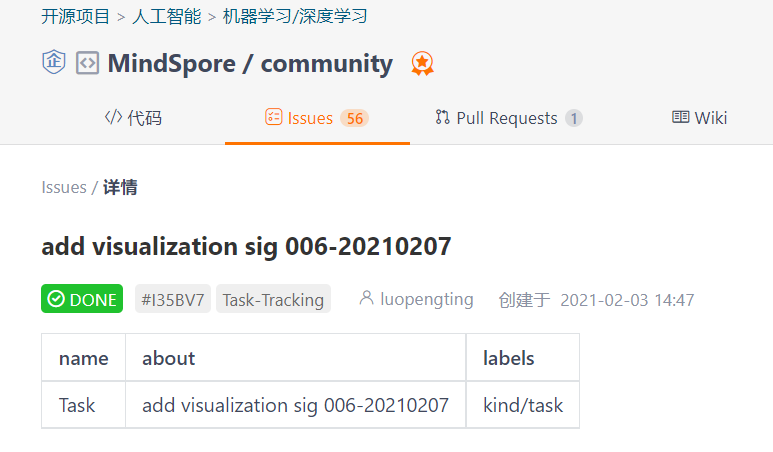
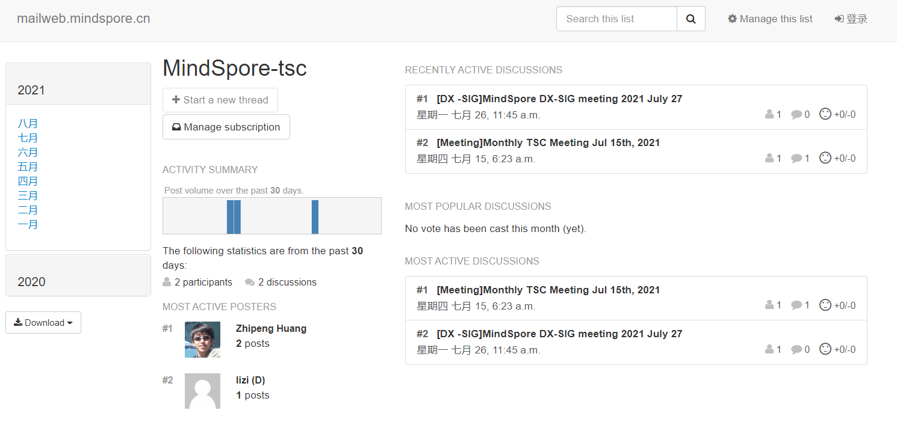

# 如何成立一个SIG（特别兴趣小组）或者WG（工作组）

## **SIG - 特别兴趣小组**

SIG（特别兴趣小组）是一个在社区具有相同兴趣的一类开发者所协商成立的小组，除涉及社区运营相关的小组外，主要承载面向版本交付的特性代码相关开发和讨论，具有长期性。每个SIG组都应该：

- 至少有1位lead，或不超过3名co-lead，他们是SIG的召集人、组织者及接口人；
- 可以有若干名approver，他们是SIG的审批人；
- 其他的contributor有权审核(review)其他社区成员的贡献。

> 通常SIG负责社区开发的某个特性或者某些共性需求，你可以邀请学术伙伴、同样技能的开发者还有你的用户一起参与。

只要对SIG组的研究领域感兴趣，任何人都可以参与贡献，并review 其他社区成员贡献。

## **WG - 社区工作组**

WG（工作组）是为了某些特定的社区事务或者问题，由不同领域的开发者协商成立的小组，一般具有临时性。每个WG的成员组成要求可参考上一节的SIG。

## **如何成立一个SIG/WG**

> 温馨提示 : 虽然任何开发者都可以发起SIG/WG，但正式成立SIG/WG还是需要一定的审核，我们正在致力于减少开发者的负担，缩短审核流程，现阶段的最佳实践如下：

1. **招募伙伴** : 由社区开发者自由组队，通常情况下，SIG/WG初始人数建议不少于3人，以便于后续的PR审核等工作。

2. **社区提交issue** : 于[社区community仓库](https://gitee.com/mindspore/community)提交issue，在社区反复讨论酝酿，逐步形成工作方案。

> 温馨提示 : 社区提交issue是快速获取社区帮助的好方法！

3. **撰写工作方案** : 团队成员撰写SIG/WG工作方案(MindSpore Enhancement Proposal - MEP)，介绍SIG/WG成立的背景，待解决的问题，初步方案，计划以及参考材料索引。具体可参考[此处](https://gitee.com/mindspore/community/tree/master/design/meps)。

4. **向TSC提交议题** : 订阅[MindSpore邮件列表](https://mailweb.mindspore.cn/hyperkitty/)，向TSC邮件地址提交SIG/WG成立议题，等待议题通过评审。

> 温馨提示 : 社区中邮件列表(maillist)保证不同社区的开发者都可以在一个统一的环境下交流，虽然最近大家都喜欢上了slack、微信等平台，但他们很难保证不同国家都可以使用，邮件也许是最古老但最具包容性的平台！

5. **准备议题材料** : 围绕MEP，可以简要介绍一下SIG/WG的背景及目标、团队成员，可以准备TSC委员们可能会问及的问题。材料模板可在[此处](https://gitee.com/mindspore/community/tree/master/slides)下载。

> **注意**：因为TSC例会是全英文的，所以建议采用英文模板。注意：为打造世界级的AI计算框架，与全世界各地的开发者进行协作，当前MindSpore是全英文运作的，所有的issue/PR均需要使用英文提交。

6. **TSC例会评审** : 在TSC例会上，SIG/WG Lead向各位与会委员进行介绍，并回答相关问题，TSC委员投票决定是否成立SIG/WG。评审通过后，将有**1个星期**的公示期。

7. **新增SIG组工作目录** : 公示完成后，请在[社区community仓库](https://gitee.com/mindspore/community)提交PR，答复之前提交的issue。在PR中新增SIG/WG目录, 撰写README，模板可参考[此处](https://gitee.com/mindspore/community/tree/master/sigs/data)

> **TSC** : Technical Steering Committee 社区技术指导委员会，是社区技术决策机构，主要审核月度社区运营结果，SIG/WG成立，决策社区重要事项及活动等。一般情况下，每个月的第二个周三会举行TSC月度例会。

### 恭喜你，你已经知道如何创建一个SIG/WG，带上你的团队在MindSpore开疆扩土，一展风采吧!

## 参考资料: 
- OpenSource Guide <https://opensource.guide/starting-a-project/>
- k8s SIG and WG <https://jimmysong.io/kubernetes-handbook/develop/sigs-and-working-group.html>