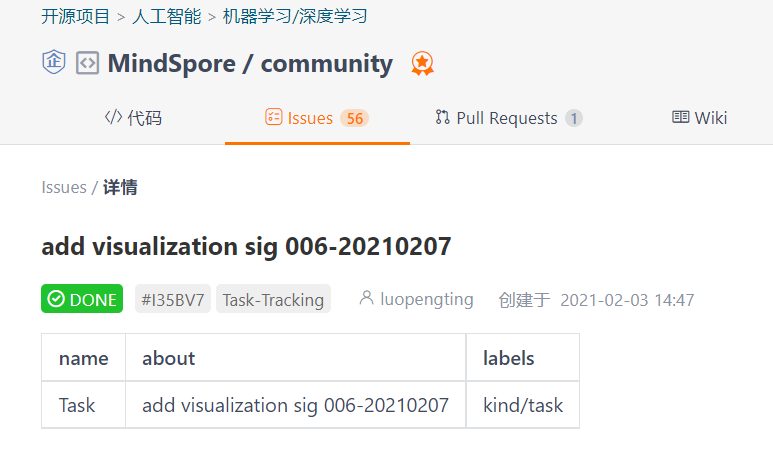
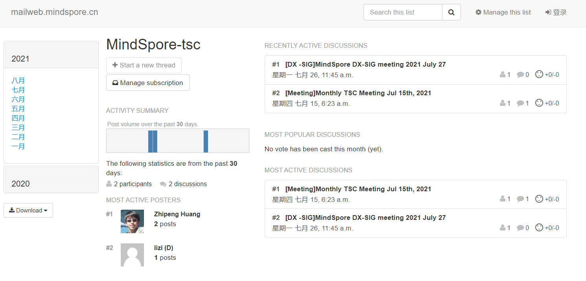

# How to build a SIG/WG

## **SIG - Special Interest Group**

SIG (Special Interest Group), It is a long-term group which is co-founded by developers with the same interests in the community. Each SIG may  

- include a lead, or up to 3 co-lead, he/she/they are the convener, organizer and coordinator of the SIG,
- include several approvers, they are the approvers of the SIG,
- and welcome all the contributors to review other's work.

> **Tips:** Usually the SIG is responsible for a certain feature or some common requirements of development. You can invite academic partners, developers with the same skills, and end users to participate in together.

Anyone in the community are welcome, as long as you are interested in the research field of the SIG group.

## **WG - Working Group**

WG (Working Group), it is built for some kind of specific affairs or problems. The group formed by developers in different fields and is generally temporary. The requirements of each WG can refer to the SIG in the previous section.

## **How to build a SIG/WG**

> **Tips:** Anyone in MindSpore could initiate a SIG/WG, however, the official establishment of the SIG/WG still requires a certain kind of review. *For experience improvement, we are working to shorten the review process.* The best practices are as follows:

1. **Recruit partners** : The team is freely organized by community developers. Normally, the initial number of SIG/WG members is recommended to be no less than 3 to facilitate the follow-up PR review and other work.

2. **Open an issue** : Submit an issue in [community repository](https://gitee.com/mindspore/community), the issue may be discussed in the community, and gradually a proposal comes.

> **Tips:** Submitting an issue to the community is a good way to quickly get help from the community.

3. **Write a proposal** : SIG/WG members should prepare the proposal (MindSpore Enhancement Proposal - MEP), introducing the background of SIG/WG, the goals, plans and reference material index. For details, please check out [MEP](https://gitee.com/mindspore/community/tree/master/design/meps)。

4. **Submit topics to TSC** : First, you may subscribe to the [MindSpore maillist](https://mailweb.mindspore.cn/hyperkitty/), in order to submit the SIG/WG topic to the TSC email address, and wait for the topic to be approved.

> **Tips:** The maillist in the community ensures that developers in different areas can communicate with each other in a unified environment. Slack and WeChat are popular among developers recently, but these IM tools can hardly guarantee that they can be used in different countries. Email may be the oldest but most inclusive platform.

5. **prepare the meeting materials** : Refer to MEP, you can briefly introduce the background and goals of SIG/WG, team members, and questions that TSC members may ask. The **template** can be downloaded [here](https://gitee.com/mindspore/community/tree/master/slides).

> **Notice**: Because English is the working language of TSC, it is recommended to use the English template. *For building a world-class AI computing framework and collaborate with developers from all over the world, MindSpore community currently operates in English, and all issues/PRs need to be submitted in English.*

6. **TSC meeting review**: At the monthly TSC meeting, SIG/WG Lead introduces the proposal to the TSC members and answers related questions. TSC members vote for whether to establish a SIG/WG. After the meeting, pre-approval period will be **1 week**.

7. **Submit a PR**: After the pre-approval period is completed, please submit a PR at [Community repository](https://gitee.com/mindspore/community) to reply to the previously issue. Create SIG/WG directory, write README, you can take [this](https://gitee.com/mindspore/community/tree/master/sigs/data) as a reference.

> **TSC** : Technical Steering Committee is a community technical decision-making organization, including reviewing monthly community operation results, the establishment of SIG/WG, and decision-making on important affairs and activities of the community. **The TSC monthly meeting will be available on the second Wednesday each month.**

### Congratulations! You are now the warrior of the community waiting for the battle that will change the world. Go ahead Sporers!

## References: 
- OpenSource Guide <https://opensource.guide/starting-a-project/>
- k8s SIG and WG <https://jimmysong.io/kubernetes-handbook/develop/sigs-and-working-group.html>