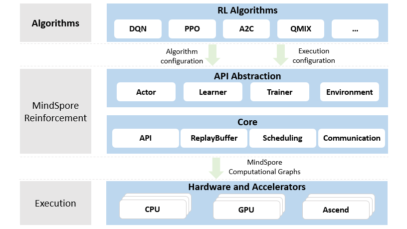

## 强化学习SIG

### 1.成立背景

强化学习（RL）是一种基于对期望行为和不期望行为分别进行奖励和惩罚的机器学习方法。智能体能够感知和解释其环境、采取行动并通过反复试验进行学习。在 AlphaGo 获得成功之后，强化学习受到了更加广泛的关注，并已经在许多领域中开展了应用。
    目前使用传统AI框架进行RL算法的模拟和应用，由于其接口的灵活性，往往需要人为重复开发一些基础框架的代码。MindSpore Reinforcement在支持可扩展的分布式多智能体异构硬件训练的同时，还提供了直观的算法编程抽象。欢迎用户积极参与MindSpore强化学习社区并提供您的反馈，社区的反馈对于MindSpore Reinforcement 未来的发展具有建设性的重要意义。

### 2.目标

强化学习 SIG将关注强化学习的计算框架开发、研究进展以及在实际场景中的各类应用，特别是专注于优化基于MindSpore的高性能可扩展的强化学习分布式计算框架，提供持续丰富的经典算法库，供强化学习的研究人员更加方便地开展感兴趣的研究工作。小组的重点工作包括以下几个方面：

* 加速MindSpore Reinforcement在实际场景中的应用以及框架的持续演进。
* 分享强化学习在算法、分布式训练以及性能优化等方面的相关研究进展。
* 组织基于MindSpore Reinforcement构建的算法以及分布式训练相关的研讨会。
* 促进MindSpore Reinforcement的用户、开发人员和研究人员之间的交流。
* 构建用于对比强化学习算法的开放平台。

### 3.提议

为了解决现有强化学习框架的局限性，欢迎在以下方面提出建议和贡献：

* 编程框架：编程框架包括actor、learner等算法API，也包括replay buffer，policy等核心组件。
* 算法样例：代码仓包含了算法库，已实现了一些常见强化学习算法，后续会逐步增加更多的算法。
* 模拟环境：常见的环境有gym、mujoco等。多样化的模拟环境和更高的采样效率有助于强化学习的研究和应用。
* 训练性能：训练性能受到许多因素影响，包括算子性能，进程间通信优化等。欢迎任何性能改进的建议。

### 4.框架架构

强化学习算法开发和多智能体分布式训练

MindSpore Reinforcement为编写强化学习算法提供了干净整洁的API抽象，它将算法与部署和执行解耦，包括硬件加速器的使用、并行度和跨进程计算的分布。MindSpore Reinforcement将强化学习的算法转换为一系列编译后的计算图，然后由MindSpore框架在Ascend、GPU或者CPU上高效运行。

强化学习套件库代码仓链接：https://gitee.com/mindspore/reinforcement

### 5.工作计划

* 初期：分享强化学习算法、多智能体强化学习、可扩展分布式训练以及性能优化等相关的研究进展，讨论学术研究以及产业应用遇到的挑战，为MindSpore Reinforcement演进提供参考。
* 中期：通过合作开发等模式，在社区开展合作研究，推动更多场景落地。
* 后期：在全球范围内开展强化学习合作研究。

### 6.小组构建

* 组长：李荣鹏，浙江大学信息与电子工程学院副教授
* 成员：Peter Pietzuch，伦敦帝国理工学院计算机系教授
* 成员：Huanzhou Zhu, 伦敦帝国理工学院计算机系博士后研究员
* 成员：Bo Zhao, 伦敦帝国理工学院计算机系博士后研究员
* 成员：cristoval，华为昇思MindSpore工程师
* 成员：wilfchen，华为昇思MindSpore工程师
* 成员：VectorSL，华为昇思MindSpore工程师
* 成员：chenyijie6，华为昇思MindSpore工程师
* 成员：Selina，昇思MindSpore布道师
