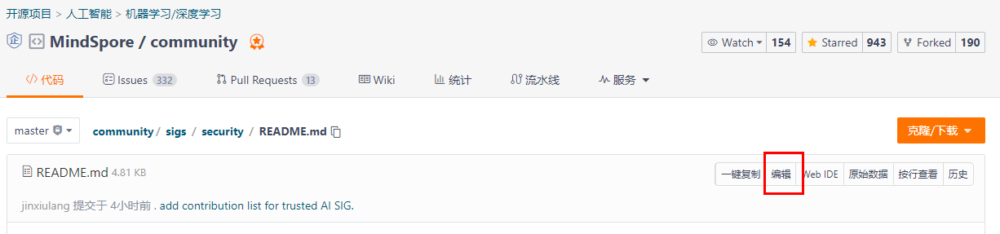

## SIG简介

Trusted AI SIG 聚焦于人工智能领域的模型、数据可信技术，致力于打造安全可靠的AI计算框架，主要包括以下几个方向：

1. **模型鲁棒性和可靠性**：对抗样本、对抗训练、AI可解释、数据概念漂移检测、模型故障注入评估。
2. **隐私保护**：差分隐私训练、联邦学习、数据脱敏、隐私泄露评估。
3. **模型部署安全**：模型加密、模型混淆等技术。

## SIG贡献榜

| 名字          | gitee_id                                                  | 社区任务积分 | 提交issue数量 | 提交PR数量 | 提交技术文章数量 | 例会分享次数 | 组织例会次数 |
|-------------|-----------------------------------------------------------|--------|-----------|--------|----------|--------|--------|
| H. Zhang    | [@shazi4399](https://gitee.com/shazi4399)                 | 80     | 0         | 2      | 1        | 1      | 0      |
| M.J. Li     | [@limingjun1](https://gitee.com/limingjun1)               | 35     | 0         | 2      | 1        | 1      | 0      |
| Z.H. Hu     | [@Mr_GerhardtHu_Fox](https://gitee.com/Mr_GerhardtHu_Fox) | 0      | 0         | 1      | 0        | 1      | 1      |
| Z.G.C Zhang | [@zhangzhugucheng](https://gitee.com/zhangzhugucheng)     | 0      | 0         | 4      | 0        | 1      | 0      |
| K.W. Chen   | [@qmckw](https://gitee.com/qmckw)                         | 0      | 0         | 1      | 1        | 0      | 0      |
| Q.H. Li     |                                                           | 0      | 0         | 0      | 1        | 0      | 0      |
| J.Y. Wang   |                                                           | 0      | 0         | 0      | 1        | 0      | 0      |

**提示：** SIG成员可以提交PR更新表格数据，提交PR时需要附上相关的依据，如PR的链接、技术文章的链接等等（如果没有，请文字说明）。

**温馨提示：** 点击代码页面上的编辑按钮（如下图所示），可以直接在网页上提交轻量化PR！

## SIG代码仓

1. [MindArmour](https://gitee.com/mindspore/mindarmour)
2. [联邦学习云侧](https://gitee.com/mindspore/mindspore/tree/master/mindspore/ccsrc/fl) 、[联邦学习端侧](https://gitee.com/mindspore/mindspore/tree/master/mindspore/lite/java/java/fl_client/src/main/java/com/mindspore/flclient)

## SIG负责人

负责SIG日常活动的运作、制定SIG成员的培养计划以及开发项目管理。

* [Ze Wang](https://gitee.com/randywangze)
* [Mr. Jin](https://gitee.com/jxlang910)
* [emmmmtang](https://gitee.com/emmmmtang)

## 2022年目标

１，在隐私保护、模型安全、鲁棒性提升等技术领域增加至少５个新特性；

２，培养至少5名SIG Committers。

## SIG的主要活动

### １，线上技术分享

时间：不定期，1-2月一次，可以在“近期活动预告”中查看

主要内容：MindSpore特性讲解、技术综述、论文分享等

分享人：SIG内部成员、业界专家教授等

### ２，技术调研

时间：每季度一次

主要内容：发布待调研的论文，SIG成员领取，并在例会上分享

负责人：Maintainers、Committers负责收集论文列表。

### ３，开发任务发放

[开源实习任务](https://gitee.com/mindspore/community/issues/I557F6)

时间：每季度一次

负责人：Maintainers、Committers

## ４，周例会(双周例会)

时间：SIG微信群内通知

例会内容：①对齐SIG成员领取的开发任务进展；②SIG成员论文分享；③技术赋能

例会记录：https://etherpad.mindspore.cn/p/meetings-Security

负责人：Maintainers、Committers轮流组织

### ５，晋升选拔

时间：半年一次

内容：选拔Committers、Maintainers

负责人：Maintainers

## 成员说明

Trusted AI SIG的成员身份包含Contributors、Committers、Maintainers，并且记录在[SIG名单](./sig_members.yaml)中，各角色的描述和申请条件如下：

### Contributors

* SIG的积极贡献者，参与SIG的日常活动、项目开发等活动，负责代码仓PR(pull requests)的review工作。
* 申请条件：至少参加2次SIG会议/活动，且至少review过[MindSpore主仓](https://gitee.com/mindspore/mindspore/pulls) 或者[MindArmour仓](https://gitee.com/mindspore/mindarmour/pulls) 的2个PR，在PR中发表的修改评论总数为10个以上。

### Committers

* SIG代码仓的Committer，拥有代码仓PR的合入权限。
* 申请条件：身份为Contributors，且至少往**SIG代码仓**中合入5个PR。

### Maintainers

* SIG运作的负责人，负责整个SIG的技术研究方向和活动组织。
* 申请条件：身份为Committers，通过Maintainers资格评审。

### 申请方式

1. Fork [Community仓库](https://gitee.com/mindspore/community) 。
2. 提交PR，把自己的Gitee主页链接、名字（不要求真名）、注册Gitee的邮箱以及兴趣方向加到[sig_members](./sig_members.yaml)中，PR的描述中需要附加申请的证明，例如评论过的PR、提交合入过的PR等等。提交PR之后，Maintainers会进行审核。

## 近期活动预告

## 往期会议

* [会议录屏](https://www.bilibili.com/video/BV14g411V7nZ?spm_id_from=333.999.0.0)
* [2022-3-15会议预告](https://mp.weixin.qq.com/s/NCw-kdQiTGXhH1BNrPiFkQ)
* [Thursday June 04, 2020](./meetings/001-20200604.md)
* [Friday July 03, 2020](./meetings/002-20200703.md)
* [Saturday August 08, 2020](./meetings/003-20200808.md)
* [Friday September 04, 2020](./meetings/004-20200904.md)
