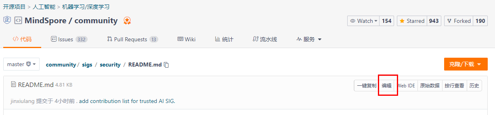

# SIG Introduction

Trusted AI SIG focuses on models and data trusted technologies in the field of artificial intelligence, and is committed to building a safe and reliable AI computing framework, mainly including the following directions:
:

1. **AI Model's robustness and reliability**: Adversarial samples, adversarial training, explainable AI, data concept drift detection and model fault injection.
2. **Privacy protection**: Differential privacy training, federated learning, data masking, privacy-leakage evaluation.
3. **Model deployment security**: Model encryption and model obfuscation.

## Contribution List

| Name        | gitee_id                                                  | community task score | Number of issues submitted | Number of PR submitted | Number of Technical blogs submitted | Number of meeting sharing | Number of meetings organized |
|-------------|-----------------------------------------------------------|----------------------|----------------------------|------------------------|-------------------------------------|---------------------------|------------------------------|
| H. Zhang    | [@shazi4399](https://gitee.com/shazi4399)                 | 80                   | 0                          | 2                      | 1                                   | 1                         | 0                            |
| M.J. Li     | [@limingjun1](https://gitee.com/limingjun1)               | 35                   | 0                          | 2                      | 1                                   | 1                         | 0                            |
| Z.H. Hu     | [@Mr_GerhardtHu_Fox](https://gitee.com/Mr_GerhardtHu_Fox) | 0                    | 0                          | 1                      | 0                                   | 1                         | 1                            |
| Z.G.C Zhang | [@zhangzhugucheng](https://gitee.com/zhangzhugucheng)     | 0                    | 0                          | 4                      | 0                                   | 1                         | 0                            |
| K.W. Chen   | [@qmckw](https://gitee.com/qmckw)                         | 0                    | 0                          | 1                      | 1                                   | 0                         | 0                            |
| Q.H. Li     |                                                           | 0                    | 0                          | 0                      | 1                                   | 0                         | 0                            |
| J.Y. Wang   |                                                           | 0                    | 0                          | 0                      | 1                                   | 0                         | 0                            |

**Hint：** SIG members can submit PR to update the above form data. When submitting PR, you need to attach relevant evidence, such as PR link, technical article link, etc. (if not, please explain in text).

**Tips：** Click the edit button on the code page (as shown in the figure below) to directly submit lightweight PR on the web page!

## SIG code repositories

1. [MindArmour](https://gitee.com/mindspore/mindarmour).
2. [Federated learning's server](https://gitee.com/mindspore/mindspore/tree/master/mindspore/ccsrc/fl), [Federated learning's client](https://gitee.com/mindspore/mindspore/tree/master/mindspore/lite/java/java/fl_client/src/main/java/com/mindspore/flclient).

## SIG maintainers

Responsible for running SIG daily activities, formulating the development map of SIG members and the management of coding projects.

* [Ze Wang](https://gitee.com/randywangze)
* [Mr. Jin](https://gitee.com/jxlang910)
* [emmmmtang](https://gitee.com/emmmmtang)

## Goals of 2022

1, Publish 5 more features of privacy protection, model security and models' robustness improvement.

2, Develop 5 more Contributors/Committers.

## SIG Activities

### 1, Online technology sharing

Time: irregular, once every 1-2 months, which can be viewed in "Recent Events Preview"

Main contents: explain MindSpore's feature, technology review, paper sharing, etc

Shared by: SIG internal members, industry experts, professors, etc

### 2, Technical research

Time: once a quarter

Main content: publish the papers to be investigated, which SIG members will receive and share at the regular meeting

Responsible persons: Maintainers and Committers are responsible for collecting the list of papers.

### 3, Publish coding projects

[Opensource internship projects](https://gitee.com/mindspore/community/issues/I557F6)

Time: once a quarter

Person in charge：Maintainers、Committers

### 4, Weekly meeting

Time: notify in SIG's WeChat group

Contents of the regular meeting: 1) synchronize the progress of development tasks; 2) SIG members' papers sharing; 3) skill empowerment for SIG members

meeting records: https://etherpad.mindspore.cn/p/meetings-Trusted_AI

Person in charge: Maintainers and Committers organize in turn

### 5, Promotions

Time: once every half a year

Content: select Committers and Maintainers

Person in charge: Maintainers

## SIG members description

The membership of the Trusted AI SIG includes Contributors, Committers, and Maintainers, and is recorded in the [members list](./sig_members.yaml). The description and application conditions of each role are as follows:

### Contributors

* An active contributor to SIG, participating in SIG's daily activities, project development and other activities. Responsible for reviewing the PR (pull requests) of the code repository.
* Application conditions: Have been participated in SIG's activities for at least two times, and have reviewed at least two PRs of the [MindSpore main warehouse](https://gitee.com/mindspore/mindspore/pulls) or [MindArmour warehouse](https://gitee.com/mindspore/mindarmour/pulls), and the total number of comments in the PR is greater than 10.

### Committers

* Committer of the SIG code repository, who has the permission to merge code repository PRs.
* Application conditions: As a Contributors, and have merged at least five PRs to **SIG code repository**.

### Maintainers

* Responsible for SIG's technical research direction and activity organizations.
* Application conditions: As a Committer and have passed the Maintainers qualification review (the organization will be organized after someone applies for it).

### Application Method

1. Fork [Community repository](https://gitee.com/mindspore/community).
2. Submit a PR. Add your Gitee Home link, name (real name is not required), email address and interested directions for registering Gitee to the [sig_members](./sig_members.yaml). Add proof of application, such as reviewed PRs and merged PRs, to the PR description. After the PR is submitted, Maintainers will review the PR.

## Recent Events Preview

## Previous Sessions

* [meeting video](https://www.bilibili.com/video/BV14g411V7nZ?spm_id_from=333.999.0.0)
* [2022-3-15 meeting forecast](https://mp.weixin.qq.com/s/NCw-kdQiTGXhH1BNrPiFkQ)
* [Thursday June 04, 2020](./meetings/001-20200604.md)
* [Friday July 03, 2020](./meetings/002-20200703.md)
* [Saturday August 08, 2020](./meetings/003-20200808.md)
* [Friday September 04, 2020](./meetings/004-20200904.md)
