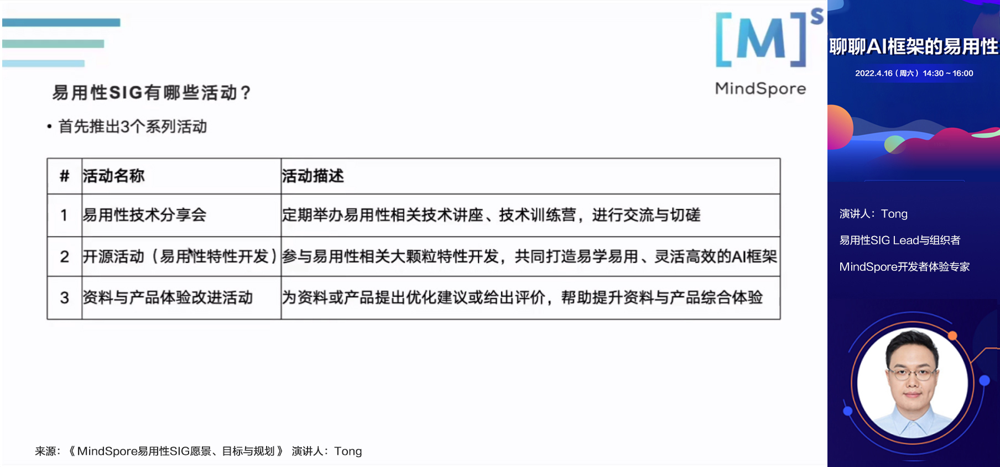
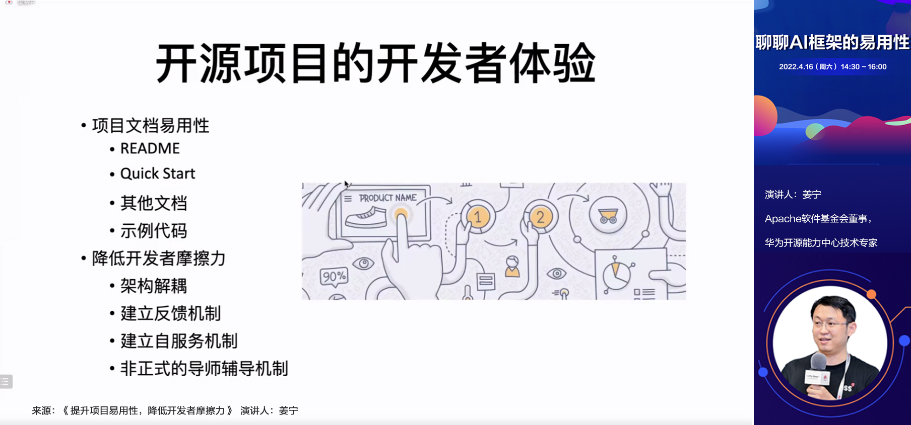
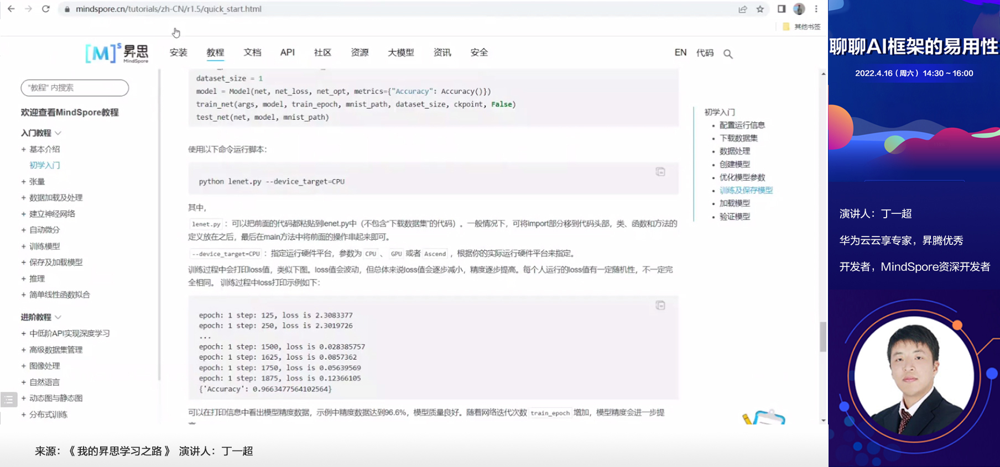

# Review of Usability SIG Tech Session on April 16th

On April 16, 2022, MindSpore Usability SIG held its first online tech session with the theme of "Let's Talk about the Usability of AI Framework". Nearly 100 developer friends participated in the activity through Tencent conference and bilibili live broadcast. Through this activity, more than 110 developers joined the Usability SIG communication group. Thank you all for your enthusiastic participation and wonderful sharing. Here we have summarized the note of the activity as well as the questions and answers. Hope you are satisfied!

## Review of Lectures

Thanks for the wonderful sharing of lecturers, they are leon-wang, Tong, Jiang Ning, Ding Yichao, thank you!

**Topic 1, MindSpore Usability SIG's Vision, Goals and Plans**: Two experts of the MindSpore team, the founders of the Usability SIG (leon-wang) and Lead (Tong), introduced the background, goals and specific activities of the Usability SIG, including tech sessions, open source internships, documents and product experience improvement activities. For details, see the presentation materials.

**Topic 2, Improve Project's Usability and Reduce Friction for Developers**: Jiang Ning, who is Apache software foundation director, Huawei open source center expert, based on his years of experience in hatch open source project, and explained the understanding of the project's usability for everyone, and how to do in the open source community by decoupling and establish feedback mechanism, since the service architecture and mentor guidance mechanism, to improve project usability methods.

**Topic 3, My Ways of Learning MindSpore**: Ding Yichao, senior developer of MindSpore, shared his two-year journey of learning MindSpore and Ascend, systematically introduced the sources of learning materials such as books, tutorials, videos and cases, and demonstrated the whole process of experiencing AI development on Ascend through Pengcheng Cloud Brain.

## Q&A

**Topic 1 related questions**

**Q: How does the open source activity mentioned in the SIG activity introduction relate to the previous Crowdsourcing activity?**

A: The scope of the crowdintelligence activities is mainly for model development and operator development, while the open source activities and open source internship activities are mainly for feature development. The Usability SIG will regularly launch the development tasks of ease-of-use related features in the open source activities and open source internship activities. For details, you can follow the notices in the community.

**Q: Will there be regular meetings of SIG in the future? If so, is it open to all?**

A: yes. The SIG regular meeting is expected to be held every two weeks and will be held after this event. The main content is SIG recent dynamic update and feature development task update. The regular meeting is open to the public and everyone can attend. The meeting information will also be published in the form of an issue in the community and notified in the wechat group.

**Q: How do I apply for open source internship? What are the requirements? What is the work content of the intern? When will the internship start?**

A: All students on campus can sign up. The specific work content of MindSpore open source internship will be released on the official website of open source Internship in the near future. Please pay attention to the news in the community, official account or wechat group.

**Topic 2 Related questions**

**Q: Maintaining open source projects is not just about code capabilities, but also adaptive community support. Can you explain this in detail? How does the community support adaptation?**

A: In addition to code capabilities, efforts should be made to improve the developer experience of open source projects, such as improving the usability of project documents, including README, Quick Start, other documents, sample code, etc., and establishing a series of mechanisms to reduce developer friction. It includes structure decoupling, feedback mechanism, self-serving mechanism, informal tutor guidance mechanism and so on.

**Q: Are the maintainers of open source projects online virtual organizations? Will there be offline entities?**

A: Most of them are virtual online organizations, because offline meeting costs are high. MindSpore has many regional organizations. If you have friends in the same city, you can meet them. For example, as I (Jiang Ning) do Apache project, it is a global virtual organization, so it is still difficult for us to meet. Now it is better, Beijing, Shanghai, Shenzhen and other places have corresponding organizations.

**Q: There is no habit of using mailing lists in China, and fewer people use them now. Is there a better way?**

A: It may be A little less used in China, but if it is used abroad, at least for Apache, the effect will be better, because we can archive, and for Apache, what does not happen in the mailing list, does not happen. For many tasks we need to do, such as making a proposal or communicating with users, we can get answers immediately by checking previous emails, which is much better than wechat. Open source I think the biggest charm is open and transparent, this can be archived mailing list of the benefits of the means of communication, one is asynchronous, another can across time and space, ready to jump of the discussion leads to a mail to discuss, anytime, anywhere can restart a month or two earlier to talk about, we are interested can try.

**Topic 3 related questions**

**Q: Mr. Ding, as a developer, what channels and platforms are you used to output the experience you have learned in MindSpore?**

A: If I think it is worth recording my personal learning experience, I will output it on Huawei Cloud Blog, Zhihu and CSDN. Usually, I will post A copy on one of these platforms and then copy it to other platforms. It is also easy to copy because it is edited in Markdown format.

**Q: When will the Chinese API (documentation) be available?**

A: The production is in full swing and is expected to be released with version 1.7 in the near future.

**Q: Mr. Ding, can you introduce some successful MindSpore cases that you have done?**

A: In the beginning, I did some performance comparison examples (training speed), and then I tried to port some TensorFlow or PyTorch code to MindSpore.

## Related Materials

1. Speech materials for this event have been released to the MindSpore community, see [link](https://gitee.com/mindspore/community/tree/master/sigs/usability/docs/tech-sessions/20220416).

2. The video of this activity has been uploaded to the official account of MindSpore at bilibili.

## A Glance at the Next Activity

Next time, we will invite several experts and developers to share their experiences on how to quickly get started with MindSpore, including multi-platform installation, convenient IDE plug-ins, migration guide from PyTorch to MindSpore and other practical technical topics. Stay tuned!

---

Join the SIG communication group to build an easy-to-learn, flexible and efficient AI framework together!

Way to join: add the wechat of the assistant (wechat: mindspore0328). Please note 'Usability SIG' when you are adding.

Assistant will invite you into the group!