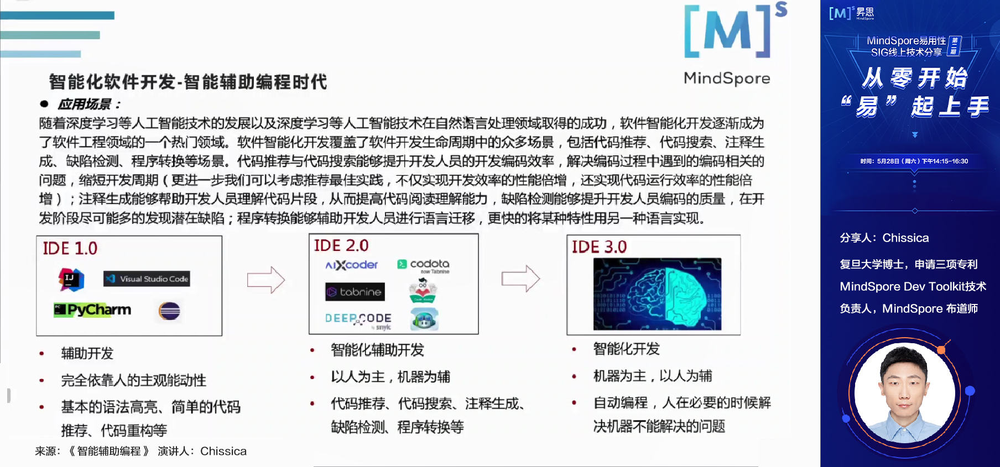
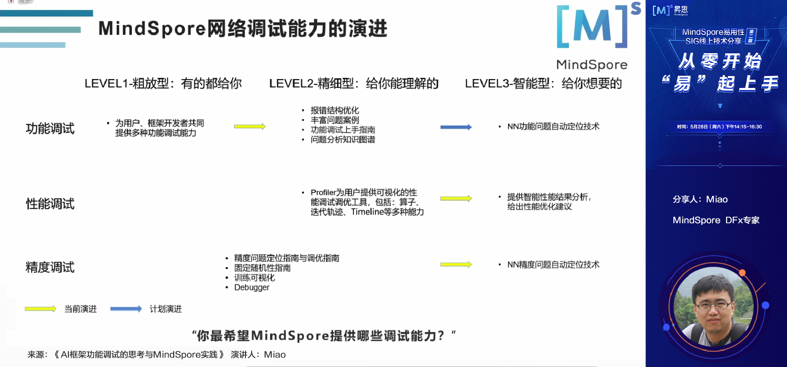
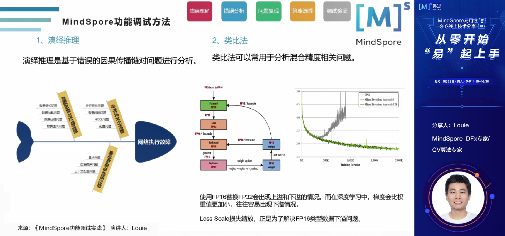
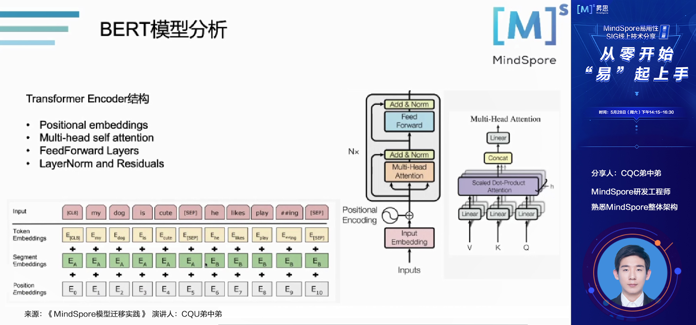

# 5月28日易用性SIG技术分享活动精彩回顾

2022年5月28日，MindSpore易用性SIG举行了第2次线上技术分享活动，主题是**《从零开始，“易”起上手》**，共有265位开发者朋友通过腾讯会议和B站直播参与了本次活动。

此次活动新吸纳了87位开发者加入易用性SIG交流群。感谢开发者们的热情参与和各位老师的精彩分享，在此我们整理了此次活动的内容摘要以及提问和回答，希望大家满意！

## 分享内容回顾

本次活动的主题是《从零开始，“易”起上手》，5位演讲嘉宾主要围绕MindSpore初学者在初学和上手MindSpore时可能遇到的主要问题，从**安装**、**编程辅助**、**调试调优**、**模型迁移**等角度进行了精彩的分享。

感谢张辉、Chissica、Miao、Louie、CQU弟中弟为大家带来的精彩分享！

**1、《MindSpore漫游世界》**：MindSpore资深开发者张辉（在社区中被大家所熟知的张小白老师）通过生动有趣的讲解，为大家介绍了MindSpore各个平行世界（各组件）的奇异景色（功能特点）以及MindSpore在多平台上的安装方法，为大家打开了一个新的视角。

**2、《智能辅助编程》**：MindSpore Dev Toolkit技术负责人、MindSpore布道师Chissica基于自己在代码推荐、代码搜索、注释生成领域的专长，为大家介绍了软件智能化开发中的关键技术——智能辅助编程的核心技术与使用场景，这些技术也已经落地到了MindSpore Dev Toolkit插件中，欢迎各位开发者去体验。

**3、《AI框架功能调试的思考与MindSpore实践》**：两位MindSpore DFx专家Miao与Louie，对他们在AI框架功能调试领域的系统性思考进行了介绍，并基于MindSpore分享了在机器学习开发功能调试中常见的问题及其解决方法。

**4、《MindSpore模型迁移经验分享》**：MindSpore易用性专家CQU弟中弟，以BERT为例，分享了从PyTorch/Tensorflow将模型迁移至MindSpore的相关方法和经验。

## Q&A环节

**Question（JeffDing）：炼丹师是不是只要会训练代码就可以（胜任）？**

Answer（张辉）：AI开发中涉及很多知识技能点，每一个人根据自己的特长在AI框架的学习和使用上找到适合自己的路就可以了。比如我个人从安装入手来学习框架，可能别人在模型调参、AI for Science等方向入手会更合适。等学会一些基本的知识技能点以后，才能更近一步。

**Question（B站听众）：MindSpore Dev Toolkit可以在哪里下载试用？**

Answer（Chissica）：MindSpore代码仓中有一个子仓：https://gitee.com/mindspore/ide-plugin，可以在这里下载试用。

**Question（B站听众）：将来是不是程序员说一个需求，AI就能直接实现了？**

Answer（Chissica）：这是一个很远大和宏伟的目标，但目前仅能做到一部分，例如业界DeepMind做的AlphaCode，能够解一部分算法题，给予算法题的描述后就能给出可运行的代码。AI辅助编程目前仅能做到单领域的某些场景，还做不到那么理想的地步。个人理解，将来不一定能完全做到那么理想，因为在软件开发过程中，有一些创造性的活动，如需求分解等，目前让人工智能来做还达不到，起码还有5-10年发展的过程，但这仍然是一块非常值得探索的技术。

**Question（Tong）：怎样去评估一个智能辅助编程系统的优劣/好坏，或说是成熟程度？**

Answer（Chissica）：一方面是通过减少程序员敲击键盘的次数来衡量，程序员敲击键盘次数越少，说明AI的辅助编程能力越全。另一方面，程序员的修改越少，也说明推荐的越准确、效果越好。引申一下，未来如果有较强的AI辅助编程工具，能够直接推荐出来可执行的程序，可以说是达到了一个巅峰的状态。

## 资料获取

1、本次活动的演讲材料将发布到MindSpore社区，请点击[链接](https://gitee.com/mindspore/community/tree/master/sigs/usability)获取。
2、本次活动的视频将上传到B站MindSpore官方账号，敬请关注。

---

加入易用性SIG交流群，共同打造易学易用、灵活高效的AI框架！

加入方式：添加小助手的微信（vx: mindspore0328），添加时请备注：易用性。

小助手拉你进群哦！