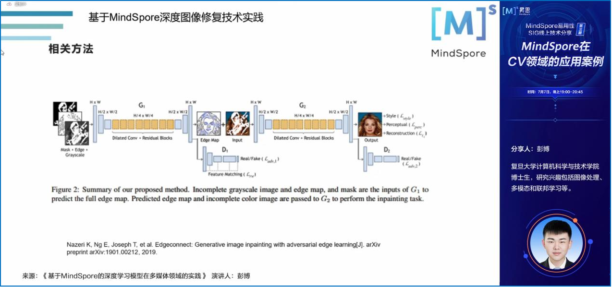
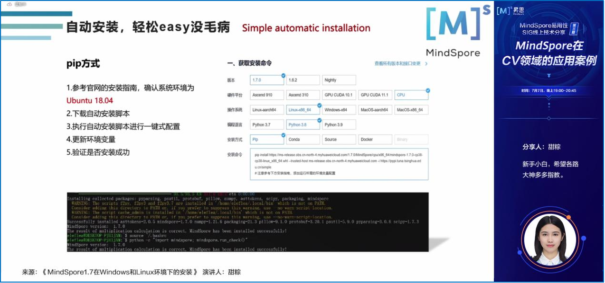

# 7月7日易用性SIG技术分享活动精彩回顾

## **易用性SIG技术分享精彩回顾**

2022年7月7日，MindSpore易用性SIG举行了第3次线上技术分享活动，主题是**《**MindSpore在CV领域的应用案例**》**，共有**150+**位开发者朋友通过腾讯会议和B站直播参与了本次活动。

此次活动新吸纳了**45**位开发者加入易用性SIG交流群。感谢开发者们的热情参与和各位老师的精彩分享，在此我们整理了此次活动的内容摘要以及提问和回答，希望大家满意！

## **分享内容回顾**

本次活动的主题是《MindSpore在CV领域的应用案例》，3位演讲嘉宾面向MindSpore初学者和有一定经验的使用者，分享MindSpore的自动、手动安装和MindSpore在CV领域的应用案例。

感谢彭博、沈阳、甜粽为大家带来的精彩分享！

**1《基于MindSpore的深度学习模型在多媒体领域的实践》**

复旦大学计算机科学与技术学院博士生彭博，围绕自己近期的工作，详细介绍了基于MindSpore深度图像修复技术实践和基于MindSpore的多模态技术在纺织工业的应用，同时，为大家分享了自己的建模思路。

**2《基于MindSpore的细粒度哈希学习》**

南京理工大学沈阳博士生沈阳，基于自身的研究工作，为大家介绍了什么是细粒度哈希、为什么需要细粒度哈希，以及哈希深度学习的关键技术等。同时，详细介绍了如何基于MindSpore实现大规模细粒度图像检索的哈希学习应用案例。

**3《MindSpore1.7在Windows和Linux环境下的安装》**

MindSpore爱好者甜粽同学，在线为大家展示了在Linux环境下如何实现MindSpore的自动安装。同时，介绍了在Windows环境下如何实现MindSpore的pip、conda和source的手动安装。

## **Q&A环节**

**Question：请问彭老师，图像修复过程中的耗时最长的是哪里？有什么好的性能优化办法？**

Answer（彭博）：我们设计这个模型实际上是一个端到端的模型，我还没有就哪一块去单独看它的耗时，我理解应该是，在编解码器过程中耗时最多的，因为他的参数量主要在这里，其他的地方像着色这块，只是对它的每一层的特征去做一个约束，这块的计算量应该是比较小的，主要是在生成器这块。如果我们想要优化的话，建议尽量压缩一下网络的参数量。

**Question：请问沈博，使用MindSpore做科研项目过程中有什么心得或经验？**

Answer（沈阳）：我觉得做科研的过程，最主要的是找到一个比较细的研究问题，有了这个研究问题之后，我们研究之后会有一个想法，得到这个想法之后，通过不同的框架去建模，在建模过程中，我们可能会觉得无论是用MindSpore还是TensorFlow、 PyTorch，本质上是同一个过程。因为我们通过这些框架的使用，可能会在参数调优上有些不同，但是只要调参得当，方法正确，都会得到一个接近SOTA或超越SOTA的一个性能，更关键的就在于怎样在最初找到一个比较好的研究方向，或者说一个比较容易出成果的科研方向。

比如说我们现在做的一些普通的论文，它的数据集是比较小的，可能框架的影响并没有那么大。

**Question：作为小白，在安装方面，有啥好的经验和建议吗？**

Answer（甜粽）：如果说电脑上之前是比较空白的一个裸机，就像Python 、conda都没有接触过，都没有装的话，我比较推荐自动安装。如果已经安装了部分的依赖项，像Python3.7.5、conda，像CMake、git还有wheel这些 手动安装是比较合适的。总体来讲，自动安装、手动安装只要你肯花时间，难度都没那么大，大家一起去摸索，探索一下，可能遇到不一样的风景。

## **资料获取**

1、本次活动的演讲材料将发布到MindSpore社区，请点击链接获取。  

https://gitee.com/mindspore/community/tree/master/sigs/usability  

2、本次活动的视频将上传到B站MindSpore官方账号，敬请关注。  

---

加入易用性SIG交流群，共同打造易学易用、灵活高效的AI框架！

加入方式：扫码添加小助手的微信（vx: mindspore0328），添加时请备注：易用性。

小助手拉你进群哦！