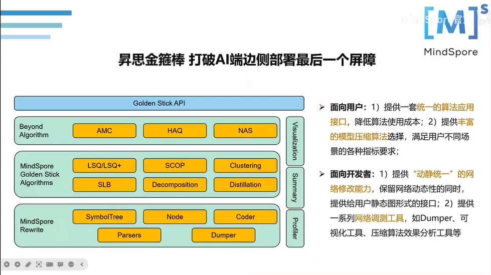
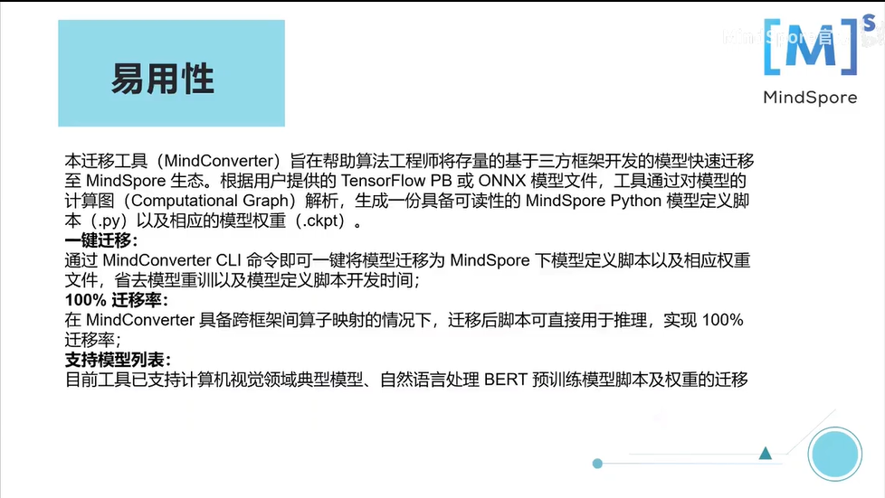
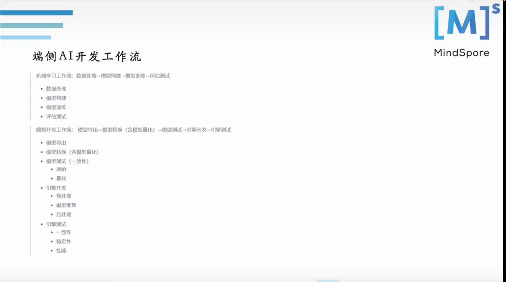

# 【精彩回顾】11月26日易用性SIG技术分享活动

## 易用性SIG技术分享精彩回顾

11月26日，MindSpore易用性SIG举行了第5次线上技术分享活动，主题是《MindSpore入门体验及昇思金箍棒简介》，共有**30****0**余位开发者朋友通过腾讯会议和B站直播参与了本次活动。

感谢开发者们的热情参与和各位老师的精彩分享，在此我们整理了此次活动的内容摘要和直播视频回放，欢迎大家观看！

## 分享内容回顾

本次活动的主题是《MindSpore入门体验及昇思金箍棒简介》，3位演讲嘉宾面向MindSpore初中级开发者，介绍了MindSpore入门实践、MindSpore Lite初体验和昇思金箍棒。

感谢韩刚强、姜文凯、邢朝龙为大家带来的精彩分享！

**1《昇思金箍棒简介》**

MindSpore研发专家韩刚强，分享了昇思金箍棒，昇思金箍棒是基于MindSpore的模型压缩算法集。

**2《成年人全都要-MindSpore函数式+Cell混合编程实践》**

MindSpore爱好者姜文凯，介绍了MindSpore框架的性能优点、使用模型的筛选进行一次性能测试代码实操和MindSpore环境的搭建以及配置。

**3《端侧AI引擎MindSpore Lite初体验》**

MindSpore布道师邢朝龙，介绍了端侧AI引擎MindSpore Lite基础入门知识及相关实践。

## 资料获取

1、本次活动的演讲材料将发布到MindSpore社区，请点击链接获取。

https://gitee.com/mindspore/community/tree/master/sigs/usability

2、本次活动的视频将上传到B站MindSpore官方账号，点击如下链接观看。

https://www.bilibili.com/video/BV1Wu411y7u1?p=10&vd_source=f199b0e3200b02f557239b1b8efa5e1e

 ---

加入易用性SIG交流群，共同打造易学易用、灵活高效的AI框架！

加入方式：扫码添加小助手的微信（vx: mindspore0328），添加时请备注：易用性。

小助手拉你进群哦！

