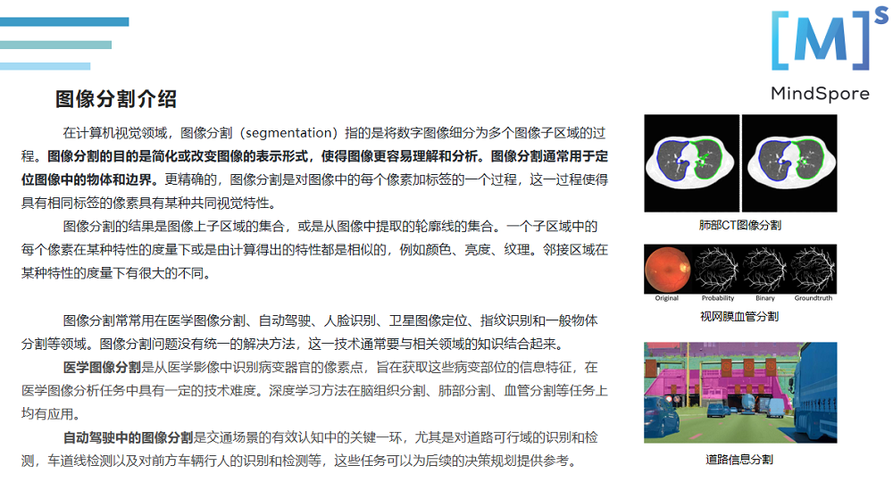
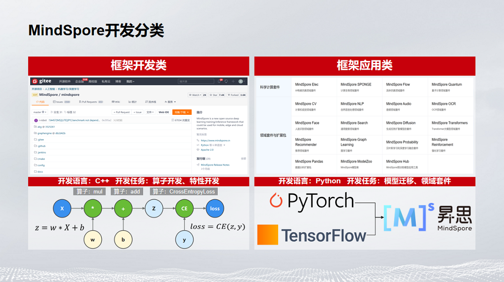
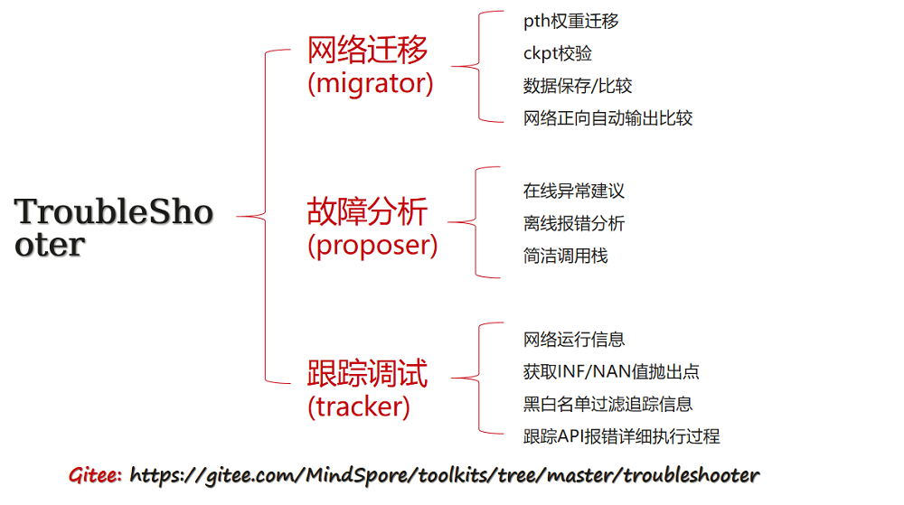

# 【精彩回顾】05月27日易用性SIG技术分享活动

## 易用性SIG技术分享精彩回顾

05月27日，MindSpore易用性SIG举行了第6次线上技术分享活动，主题是《基于昇思MindSpore的实践应用与调试工具包》。

感谢开发者们的热情参与和各位老师的精彩分享，在此我们整理了此次活动的内容摘要和直播视频回放，欢迎大家观看！

## 分享内容回顾

本次活动面向昇思MindSpore易用性SIG成员和更广大的开发者，分享基于昇思MindSpore的图像分割应用、实践促学-昇思MindSpore开发与应用分享、昇思MindSpore网络开发调试工具包。

感谢李雪松、王振邦、樊大为给大家带来的精彩分享！

**1《基于昇思MindSpore的图像分割应用》**

上海交通大学的李雪松老师，分享了图像分割介绍，以及基于昇思MindSpore的图像分割应用。

**2《实践促学-昇思MindSpore开发与应用分享》**

MindSpore布道师王振邦，介绍了昇思MindSpore相关项目的开发经历，包括：算子开发与优化、模型迁移、ONNX模型转换，分享参与昇思MindSpore项目的收获。

**3《昇思MindSpore网络开发调试工具包》**

昇思MindSpore工具链模块设计师樊大为，介绍了融合跟踪调试、网络迁移、故障分析三大核心功能的TroubleShooter。

## 资料获取

1、本次活动的演讲材料将发布到MindSpore社区，请点击链接获取。

https://gitee.com/mindspore/community/tree/master/sigs/usability

2、本次活动的视频将上传到B站MindSpore官方账号，点击如下链接观看。

https://www.bilibili.com/video/BV1Wu411y7u1?p=19&vd_source=e140c6ab8572efad5637721b5ca45477

---

加入易用性SIG交流群，共同打造易学易用、灵活高效的AI框架！

加入方式：扫码添加小助手的微信（vx: mindspore0328），添加时请备注：易用性。

小助手拉你进群哦！

