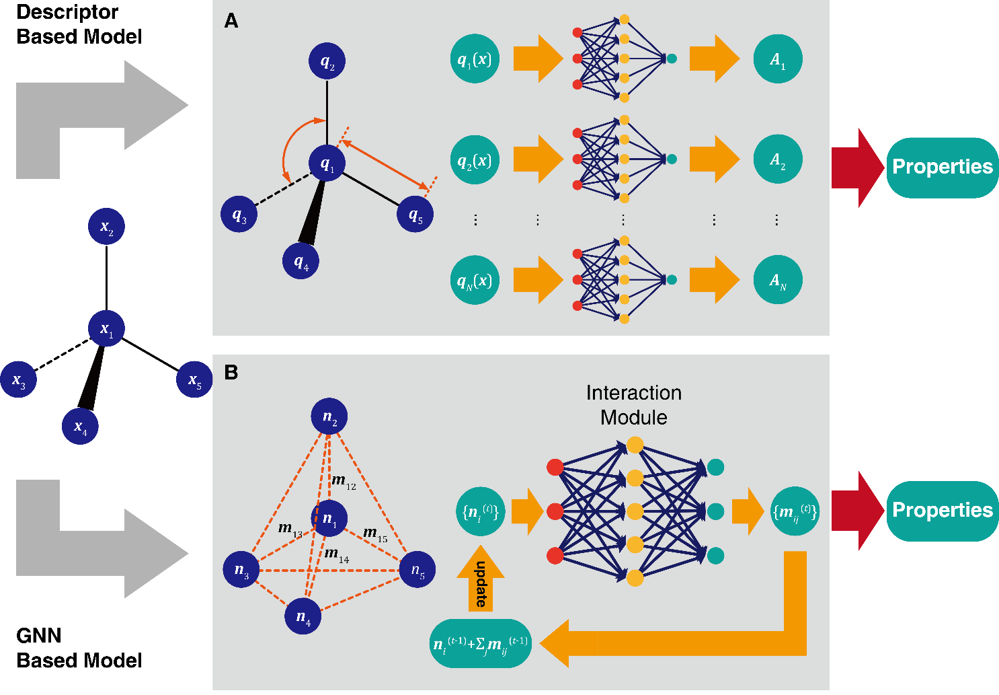
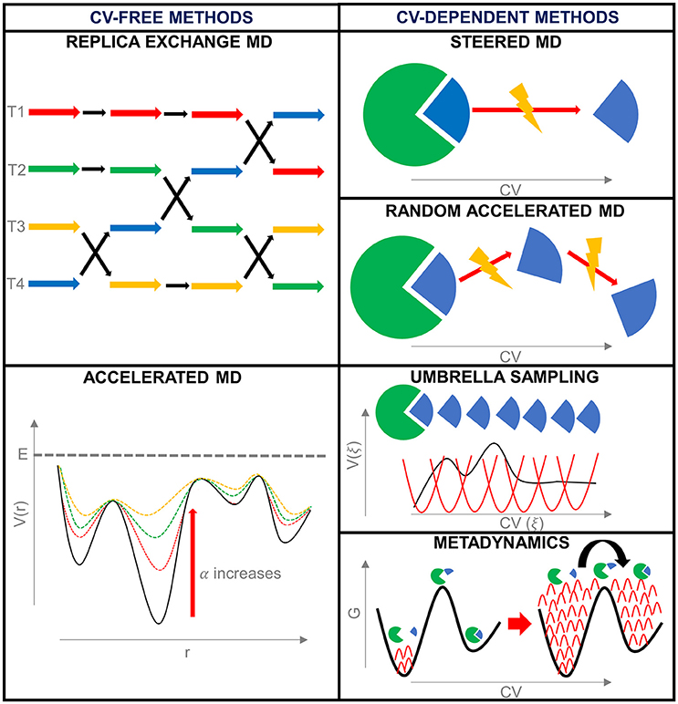

# MindSpore Molecular Modeling Working Group (WG)

## Summary

MindSpore Molecular Modeling WG aims to build a community collaboration for deep learning framework's application in molecular modeling and simulation.

# WG Co-chairs

* Yi Yang (Shenzhen Bay Laboratory)
* Jun Zhang (Shenzhen Bay Laboratory)

## Motivation

Deep learning is transforming many areas in science, and it has great potential in
modeling molecular systems. However, unlike the mature deployment of deep learning in
computer vision and natural language processing, its development in molecular modeling and
simulations is still at an early stage, largely because the inductive biases of molecules are
completely different from those of images or texts.[0]

  

### Goals

The goal of the Molecular Modeling WG are as follows:
- Provide MM specific requirements to related SIGs for each release cycle, and monitoring its implementation via labeled ISSUE/PR.
- Provide documentations on MM support in MindSpore.
- Incubate SIG that will be responsible for developing MM specific libs when necessary and approved by TSC.

### Non-Goals

- Full stack MM software implementation is out of scope of this WG.

## Proposal

### User Stories

For deep learning models and algorithms which handle molecules as geometric identities in the 3D Euclidean space, the (fully connected) graph is a reasonable data structure representing the 3D geometry of molecules, and the deep molecular models dealing with the 3D structures are mostly physics-based and can be used to encode or predict configuration-dependent molecular properties.

From a relatively orthogonal viewpoint, the individual molecules (e.g., small organic compounds and structured macromolecules) can also be regarded as other data structures, for instance, sequences (e.g., SMILES134 or sequence of amino acids) or sparse molecular graphs,etc. Deep learning models based on these data structures are mostly information-based, and they can help researchers navigate through the chemical space and change the way of data-mining for cheminformatics. As demonstrated by AlphaFold, we believe that combining the physics-based deep molecular models and the information-based deep learning methods will bring about new solutions to many long-standing problems in physics, chemistry, and biology.

Last but not least, in order to democratize deep learning for molecular modeling and simulations, it is necessary to develop special-purpose hardware and software suitable for fast and userfriendly computation. For example, molecular simulation community will definitely benefit from the auto-differentiation and parallel computation techniques which are the bedrocks of modern large-scale deep learning. Also, as machine learners and molecular simulation practitioners usually work in different platforms, a proper linker or interface which could integrate the molecular modeling software and deep learning software is highly desired. Indeed, researchers from both scientific and business communities like Google are making efforts to this end.

With the improvement of the infrastructure, deep learning is expected to bring a larger impact and more opportunities to molecular modeling and simulations in the near future.

  

## Infrastructure Needed (optional)

Ascend hardware resources are needed.

## References (optional)

[0] A Perspective on Deep Learning for Molecular Modeling and Simulations. https://dx.doi.org/10.1021/acs.jpca.0c04473
