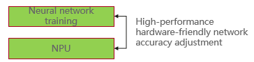

# Topic1:  Low-bit Neural Networks Training  

## Motivation:

​	At present, mixed precision can automatically adjust the accuracy of fp16 and fp32 for the network to improve training performance and memory optimization. Because operators have different costs on different AI chips, all optimization strategies for different AI chips are different. The network configuration of different hardware is different, so how to automatically generate the precision adjustment strategy that adapts to various hardware, especially the low bit strategy has become a difficult problem.

## Target:

​	Self-adaptively provides a low-bit precision training mechanism for various networks.

## Method:

​	We expect the applicant can conduct low-bit neural networks training  research based on MindSpore, and hope to get your valuable suggestions to MindSpore in the process. We will do our best to improve the capabilities of the MindSpore framework and  provide you with the most powerful technical support.

## How To Join

1. Submit an issue/PR based on community discussion for consultation or claim on related topics
2. Submit your proposal to us by email xxx@huawei.com